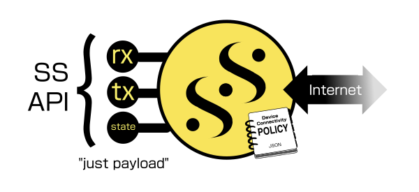
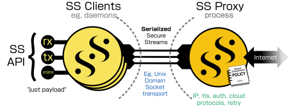
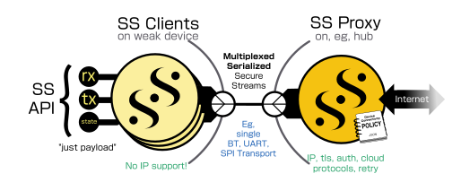

   

# Libwebsockets

** v4.4 is released, you can follow it on v4.4-stable **

Libwebsockets is a simple-to-use, MIT-license, pure C library providing client and server
for **http/1**, **http/2**, **websockets**, **MQTT** and other protocols in a security-minded,
lightweight, configurable, scalable and flexible way.  It's easy to build and
cross-build via cmake and is suitable for tasks from embedded RTOS through mass
cloud serving.

It supports a lot of lightweight ancilliary implementations for things like JSON,
CBOR, JOSE, COSE, and supports OpenSSL and MbedTLS v2 and v3 out of the box for everything.
It's very gregarious when it comes to event loop sharing, supporting libuv, libevent, libev,
sdevent, glib and uloop, as well as custom event libs.

[100+ independent minimal examples](https://libwebsockets.org/git/libwebsockets/tree/minimal-examples) for various scenarios, CC0-licensed
(public domain) for cut-and-paste, allow you to get started quickly.

[There are a lot of READMEs](https://libwebsockets.org/git/libwebsockets/tree/READMEs) on a variety of topics.

[We do a huge amount of CI testing per push](https://libwebsockets.org/sai/), currently 582 builds on 30 platforms.
[You can see the lws CI rack and read about how lws-based Sai is used to coordinate all the testing](https://warmcat.com/2021/08/21/Sai-CI.html).

News
----

## HTML + CSS + JPEG + PNG display stack in lws

Want to drive your EPD or TFT / OLED display using HTML + CSS?  Only got an ESP32?

Want remote JPEGs, PNGs, HTML, RGBA composition, gamma, error diffusion if needed?

Realtime render into a line buffer because you don't have enough heap for a framebuffer?

[Take a look here...](https://libwebsockets.org/git/libwebsockets/tree/READMEs/README.html-parser.md)

## Perl binding for lws available

Thanks to Felipe Gasper, there's now a [perl binding for lws available at metacpan](https://metacpan.org/pod/Net::Libwebsockets),
this uses the recent generic event loop support in lws to have lws as a guest on an existing perl event loop.

## Lws examples switching to Secure Streams

**Secure Streams** support in lws was introduced a couple of years ago, it's a
higher-level interface to lws `wsi`-level apis that simplifies connectivity by
segregating connection policy like protocol and endpoint information into a
separate [JSON policy file](./minimal-examples/client/hello_world/example-policy.json), and just having the [code deal with payloads](./minimal-examples/clients/hello_world/hello_world-ss.c); as many
details of the wire protocol as possible are hidden or moved to the policy, so
user code is almost identical even if the wire protocol changes.

The user code just asks to create a SS by "streamtype name", it is created
according to the details (protocol, endpoint, etc) under the same name in the
policy.

Key policy entries like endpoint can contain `${metadata-name}` string
substitutions to handle runtime adaptations via metadata.  h1, h2, ws and mqtt
are supported.

As a layer on top of the `wsi` apis, SS provides a higher-level way to access
the existing wsi-level capabilities, both kinds of API will remain supported.
Secure Streams are longer-lived than a single wsi, so an SS can coordinate
retries by itself.  SS-based user code is typically significantly smaller and
more maintainable than wsi layer.

In main branch I have moved the older examples into `./minimal-examples-lowlevel`
and am starting to port more cases from there into SS-based examples.

### Comparison between wsi and SS level lws usage

|Feature|"low-level" wsi way|Secure Streams way|
|---|---|---|
|Create context|code|same|
|Loop support, sul scheduler|default, event libs|same|
|Supports comms mode|Client, Server, Raw|same|
|Supports protocols|h1, h2, ws, mqtt (client)|same|
|TLS support|mbedtls (including v3), openssl (including v3), wolfssl, boringssl, aws-lc, libressl|same|
|Serializable, proxiable, muxable, transportable|No|Yes|
|Auto-allocated per-connection user object|pss specified in lws_protocols|Specified in ss info struct|
|Connection User API|Protocol-specific lws_protocols cbs (> 100)|SS API (rx, tx, state callbacks only)|
|Sending adaptation|lws_callback_on_writeable()  + WRITEABLE|lws_ss_request_write() + tx() cb|
|Sending buffer|User-chosen + malloc'd partial handling|SS-provided, no partials|
|Create vhosts|code|**JSON policy**|
|TLS validation|cert bundle or code|**JSON policy**, or cert bundle|
|Connection retry / backoff|code|**JSON policy**, Auto|
|Nailing up|code|**JSON policy**, Auto|
|Endpoint and protocol details|spread around the code|**JSON policy**|
|Protocol selection, pipeline / stream sharing|code|**JSON policy**|
|ws subprotocol selection|code|**JSON policy**|
|ws binary / text|code|**JSON policy**|
|Protocol-specific metadata|Protocol-specific apis in code (eg, lws_hdr)|**JSON policy**, generic metadata apis in code|
|Connection validity rules|struct|**JSON policy**, Auto|
|Stream as Long Poll|code|**JSON policy**|
|Auth|code|**JSON policy** + automatic rotation if provider supported, else code|

### Serialized Secure Streams

Secure Streams APIs are also **serializable**, the exact same client code can
fulfil the connection directly in the same process as you would expect, or
forward the actions, metadata and payloads to an [SS Proxy](./minimal-examples/ssproxy/ssproxy-socket) that owns the policy
over a Unix Domain or TCP socket connection to be fulfilled centrally.  This
allows, eg, h2 streams from different processes sharing a single connection.

The serialized SS can also travel over generic transports like UART, an [example
is provided implementing the Binance example on an RPi Pico](./minimal-examples/embedded/pico/pico-sspc-binance) with a UART transport
to a [UART transport SS proxy](./minimal-examples/ssproxy/ssproxy-custom-transport-uart), where the pico itself has no network stack, tls, compression or
wss stack, but can send and receive to and from the endpoint as if it did.

The optional `lws_trasport_mux` is used to interpose between the UART transport
and the SSPC layer, allowing a single pipe to carry many separate SS connections.

The user SS code is identical however it is transported, muxed and fulfilled.

## v4.3 is released

See the [changelog](https://libwebsockets.org/git/libwebsockets/tree/changelog)

## Support

This is the libwebsockets C library for lightweight websocket clients and
servers.  For support, visit

 https://libwebsockets.org

You can get the latest version of the library from git:

- https://libwebsockets.org/git

Doxygen API docs for development: https://libwebsockets.org/lws-api-doc-main/html/index.html

