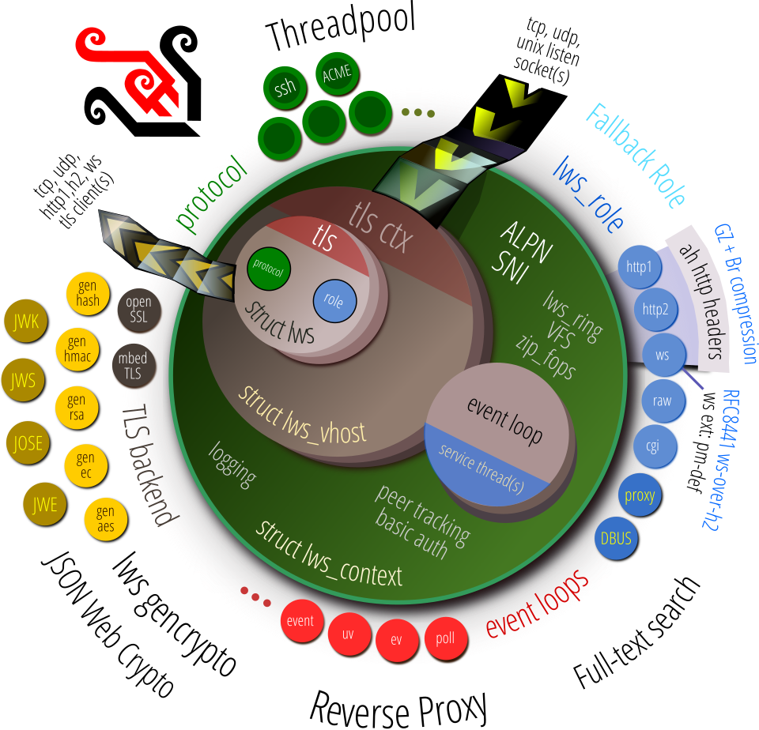

[](https://libwebsockets.org/git/libwebsockets) [](https://scan.coverity.com/projects/3576) [](https://bestpractices.coreinfrastructure.org/projects/2266) [](https://www.codacy.com/app/lws-team/libwebsockets?utm_source=github.com&amp;utm_medium=referral&amp;utm_content=warmcat/libwebsockets&amp;utm_campaign=Badge_Grade) [](https://lgtm.com/projects/g/warmcat/libwebsockets/alerts/) [](https://lgtm.com/projects/g/warmcat/libwebsockets/context:cpp) [](https://lgtm.com/projects/g/warmcat/libwebsockets/context:javascript)

# Libwebsockets

Libwebsockets is a simple-to-use, MIT-license, pure C library providing client and server
for **http/1**, **http/2**, **websockets**, **MQTT** and other protocols in a security-minded,
lightweight, configurable, scalable and flexible way.  It's easy to build and
cross-build via cmake and is suitable for tasks from embedded RTOS through mass
cloud serving.

[80 independent minimal examples](https://libwebsockets.org/git/libwebsockets/tree/minimal-examples) for
various scenarios, CC0-licensed (public domain) for cut-and-paste, allow you to get started quickly.



News
----

## v4.1.0 and v4.1-stable are released

See the [changelog](https://libwebsockets.org/git/libwebsockets/tree/changelog), summary

 - NEW: travis / appveyor / bintray are replaced by Sai
   https://libwebsockets.org/sai/ which for lws currently does 167 builds per
   git push on 16 platforms, all self-hosted.  The homebrew bash scripts used
   to select Minimal examples are replaced by CTest.  Platforms currently
   include Fedora/AMD/GCC, Windows/AMD/mingw32, Windows/AMD/mingw64, Android/
   aarch64/LLVM, esp-idf (on WROVER-KIT and HELTEC physical boards), Fedora/
   RISCV (on QEMU)/GCC, CentOS8/AMD/GCC, Gentoo/AMD/GCC, Bionic/AMD/GCC,
   Linkit 7697, Focal/AMD/GCC, Windows (on QEMU)/AMD/MSVC,
   Focal/aarch64-RPI4/GCC, iOS/aarch64/LLVM and OSX/AMD/LLVM.

 - NEW: The single CMakeLists.txt has been refactored and modernized into smaller
 CMakeLists.txt in the subdirectory along with the code that is being managed
 for build by it.  Build options are still listed in the top level as before
 but the new way is much more maintainable.

 - NEW: Captive Portal Detection.  Lws can determine if the active default
 route is able to connect to the internet, or is in a captive portal type
 situation, by trying to connect to a remote server that will respond in an
 unusual way, like provide a 204.

 - NEW: Secure streams: Support system trust store if it exists
                        Build on Windows
			Support lws raw socket protocol in SS
			Support Unix Domain Socket transport

 - NEW: Windows: Support Unix Domain Sockets same as other platforms

 - NEW: Windows: Build using native pthreads, async dns, ipv6 on MSVC

 - NEW: lws_struct: BLOB support

 - NEW: lws_sul: Now provides two sorted timer domains, a default one as
 before, and another whose scheduled events are capable to wake the system from suspend

 - NEW: System Message Distribution: lws_smd provides a very lightweight way
 to pass short messages between subsystems both in RTOS type case where the
 subsystems are all on the lws event loop, and in the case participants are in
 different processes, using Secure Streams proxying.   Participants register a bitmap
 of message classes they care about; if no particpant cares about a particular message,
 it is rejected at allocation time for the sender, making it cheap to provide messages
 speculatively.  See lib/system/smd/README.md for full details.

 - NEW: lws_drivers: wrappers for SDK driver abstractions (or actual drivers)
		 See lib/drivers/README.md, example implementations
		 minimal-examples/embedded/esp32/esp-wrover-kit
                     - generic gpio
		     - generic LED (by name)    lib/drivers/led/README.md
		     - generic PWM, sophisticated interpolated table
		                    sequencers with crossfade  
		     - generic button (by name), with debounce and press classification
		                       emitting rich SMD click, long-click, double-click,
				       down, repeat, up JSON messages
				       lib/drivers/button/README.md
		     - bitbang i2c on generic gpio (hw support can use same
		                       abstract API)
		     - bitbang spi on generic gpio (hw support can use same
		                       abstract API)
		     - generic display object, can be wired up to controller
		                  drivers that hook up by generic i2c or spi,
				  generic backlight PWM sequencing and
				  blanking timer support
		     - generic settings storage: get and set blobs by name
		     - generic network device: netdev abstract class with
	                                       WIFI / Ethernet implementations
					       using underlying SDK APIs;
					       generic 80211 Scan managements
					       and credentials handling via
					       lws_settings
		     This is the new way to provide embedded platform
		     functionality that was in the past done like
		     esp32-factory.  Unlike the old way, the new way has no
		     native apis in it and can be built on other SDK / SoCs
		     the same.

 - NEW: Security-aware JWS JWT (JSON Web Tokens) apis are provided on top of the existing
 JOSE / JWS apis.  All the common algorithms are available along with some
 high level apis like lws http cookie -> JWT struct -> lws http cookie.

 - REMOVED: esp32-helper and friends used by esp32-factory now lws_drivers
 exists

 - REMOVED: generic sessions and friends now JWT is provided

## v4.0 is released

Users wanting a stable branch should follow v4.0-stable to get the most stable version
at any given time.

See the [changelog](https://libwebsockets.org/git/libwebsockets/tree/changelog) for
information on the huge amount of new features in this release, and additional information
below.

```
 - NEW: Lws is now under the MIT license, see ./LICENSE for details
 
 - NEW: GLIB native event loop support, lws + gtk example

 - NEW: native lws MQTT client... supports client stream binding like h2 when
   multiple logical connections are going to the same endpoint over MQTT, they
   transparently and independently share the one connection + tls tunnel
 
 - NEW: "Secure Streams"... if you are making a device with client connections
   to the internet or cloud, this allows separation of the communications
   policy (endpoints, tls cert validation, protocols, etc) from the code, with
   the goal you can combine streams, change protocols and cloud provision, and
   reflect that in the device's JSON policy document without having to change
   any code.

 - NEW: lws_system: New lightweight and efficient Asynchronous DNS resolver
   implementation for both A and AAAA records, supports recursive (without
   recursion in code) lookups, caching, and getaddrinfo() compatible results
   scheme (from cache directly without per-consumer allocation).  Able to
   perform DNS lookups without introducing latency in the event loop.

 - NEW: lws_system: ntpclient implementation with interface for setting system
   time via lws_system ops
 
 - NEW: lws_system: dhcpclient implementation
 
 - NEW: Connection validity tracking, autoproduce PING/PONG for protocols that
   support it if not informed that the connection has passed data in both
   directions recently enough

 - NEW: lws_retry: standardized exponential backoff and retry timing based
   around backoff table and lws_sul

 - NEW: there are official public helpers for unaligned de/serialization of all
   common types, see eh, lws_ser_wu16be() in include/libwebsockets/lws-misc.h

 - NEW: lws_tls_client_vhost_extra_cert_mem() api allows attaching extra certs
   to a client vhost from DER in memory
   
 - NEW: lws_system: generic blobs support passing auth tokens, per-connection
   client certs etc from platform into lws

 - NEW: public helpers to consume and produce ipv4/6 addresses in a clean way,
   along with lws_sockaddr46 type now public.  See eg, lws_sockaddr46-based
   lws_sa46_parse_numeric_address(), lws_write_numeric_address()
   in include/libwebsockets/lws-network-helper.h

 - Improved client redirect handling, h2 compatibility
 
 - NEW: lwsac: additional features for constant folding support (strings that
   already are in the lwsac can be pointed to without copying again), backfill
   (look for gaps in previous chunks that could take a new use size), and
   lwsac_extend() so last use() can attempt to use more unallocated chunk space

 - NEW: lws_humanize: apis for reporting scalar quanties like 1234 as "1.234KB"
   with the scaled symbol strings passed in by caller

 - NEW: freertos: support lws_cancel_service() by using UDP pair bound to lo,
   since it doesn't have logical pipes

 - NEW: "esp32" plat, which implemented freertos plat compatibility on esp32, is
   renamed to "freertos" plat, targeting esp32 and other freertos platforms

 - NEW: base64 has an additional api supporting stateful decode, where the input
   is not all in the same place at the same time and can be processed
   incrementally

 - NEW: lws ws proxy: support RFC8441
   
 - NEW: lws_spawn_piped apis: generic support for vforking a process with child
   wsis attached to its stdin, stdout and stderr via pipes.  When processes are
   reaped, a specified callback is triggered.  Currently Linux + OSX.
   
 - NEW: lws_fsmount apis: Linux-only overlayfs mount and unmount management for
   aggregating read-only layers with disposable, changeable upper layer fs

 - Improvements for RTOS / small build case bring the footprint of lws v4 below
   that of v3.1 on ARM 
   
 - lws_tokenize: flag specifying # should mark rest of line as comment

 - NEW: minimal example for integrating libasound / alsa via raw file

 - lws_struct: sqlite and json / lejp translation now usable


```

## Introducing Secure Streams client support

Secure Streams is an optional layer above lws (`-DLWS_WITH_SECURE_STREAMS=1`) that
separates connectivity policy into a JSON document, which can be part of the
firmware or fetched at boot time.

Code no longer deals with details like endpoint specification or tls cert stack used
to validate the remote server, it's all specified in JSON, eg, see
[this example](https://warmcat.com/policy/minimal-proxy.json).  Even the protocol to use to talk to the
server, between h1, h2, ws or MQTT, is specified in the policy JSON and the code
itself just deals with payloads and optionally metadata, making it possible to
switch endpoints, update certs and even switch communication protocols by just
editing the JSON policy and leaving the code alone.

Logical Secure Stream connections outlive any underlying lws connection, and support
"nailed-up" connection reacquisition and exponential backoff management.

See [./lib/secure-streams/README.md](https://libwebsockets.org/git/libwebsockets/tree/lib/secure-streams/README.md) and the related minimal examples
for more details.

## mqtt client support

If you enable `-DLWS_ROLE_MQTT=1`, lws can now support QoS0 and QoS1 MQTT client
connections.  See the examples at ./minimal-examples/mqtt-client

## libglib native event loop support

glib's event loop joins libuv, libevent and libev support in lws for both the
`lws_context` creating and owning the loop object for its lifetime, and for
an already-existing "foreign loop" where the `lws_context` is created, attaches,
detaches, and is destroyed without affecting the loop.

This allows direct, lock-free integration of lws functionality with, eg, a GTK app's
existing `GMainLoop` / glib `g_main_loop`.  Just select `-DLWS_WITH_GLIB=1` at cmake
time to enable.  The -eventlib minimal examples also support --glib option to
select using the glib loop at runtime.

There's also a gtk example that is built if lws cmake has `-DLWS_WITH_GTK=1`.

## `lws_system` helper for attaching code to a single event loop from another thread

`lws_system` ops struct now has a member that enables other threads (in the
same process) to request a callback they define from the lws event loop thread
context as soon as possible.  From here, in the event loop thread context,
they can set up their lws functionality before returning and letting it
operate wholly from the lws event loop.  The original thread calling the
api to request the callback returns immediately.

## Improvements on tx credit

H2 clients and servers can now modulate RX flow control on streams precisely,
ie, define the size of the first incoming data and hand out more tx credit
at timing of its choosing to throttle or completely quench the remote server
sending as it likes.

The only RFC-compatible way to acheive this is set the initial tx credit to
0 and set it explicitly when sending the headers... client code can elect to
do this rather than automatically manage the credit by setting a new flag
LCCSCF_H2_MANUAL_RXFLOW and indicating the initial tx credit for that stream
in client connection info member manual_initial_tx_credit.  A new public api
lws_wsi_tx_credit() allows dynamic get and add to local and estimated remote
peer credit for a connection.  This api can be used without knowing if the
underlying connection is h2 or not.

## `lws_system`: DHCP client

DHCP client is now another network service that can be integrated into lws, with
`LWS_WITH_SYS_DHCP_CLIENT` at CMake.  When enabled, the `lws_system` state
is held at `DHCP` until at least one registered network interface acquires a
usable set of DHCP information including ip, subnet mask, router / gateway
address and at least one DNS server.

See the [api-test-dhcp](https://libwebsockets.org/git/libwebsockets/tree/minimal-examples/api-tests/api-test-dhcpc) Minimal Example for how to use.

## UDP integration with `lws_retry`

UDP support in lws has new helper that allow `lws_retry` to be applied for retry,
and the ability to synthesize rx and tx udp packetloss systemwide to confirm
retry strategies.  Since multiple transactions may be in flight on one UDP
socket, the support relies on an `lws_sul` in the transaction object to manage
the transaction retries individually.

See `READMEs/README.udp.md` for details.

## `lws_system`: system state and notification handlers

Lws now has the concept of systemwide state held in the context... this is to
manage that there may be multiple steps that need the network before it's possible
for the user code to operate normally.  The steps defined are

`CONTEXT_CREATED`, `INITIALIZED`, `IFACE_COLDPLUG`, `DHCP`, `TIME_VALID`, `POLICY_VALID`,
`REGISTERED`, `AUTH1`, `AUTH2`, `OPERATIONAL` and `POLICY_INVALID`.  OPERATIONAL is the
state where user code can run normally.

User and other parts of lws can hook notifier callbacks to receive and be able to
veto system state changes, either definitively or because they have been triggered
to perform a step asynchronously and will move the state on themselves when it
completes.

By default just after context creation, lws attempts to move straight to OPERATIONAL.
If no notifier interecepts it, it will succeed to do that and operate in a
backwards-compatible way.  Enabling various features like lws ntpclient also enable
notifiers that hold progress at the related state until their operation completes
successfully, eg, not able to enter `TIME_VALID` until ntpclient has the time.

See `READMEs/README.lws_system.md` for details.

## `lws_system`: HAL ops struct

Lws allows you to define a standardized ops struct at context creation time so your
user code can get various information like device serial number without embedding
system-specific code throughout the user code.  It can also perform some generic
functions like requesting a device reboot.

See `READMEs/README.lws_system.md` for details.

## `lws_system`: ntpclient

Optional lws system service enabled by cmake `-DLWS_WITH_SYS_NTPCLIENT` intercepts
the `lws_system` `TIME_VALID` state and performs ntpclient to get the date and time
before entering `TIME_VALID`.  This allows user code to validate tls certificates
correctly knowing the current date and time by the time it reached OPERATIONAL.

## Connection Validity tracking

Lws now allows you to apply a policy for how long a network connection may go
without seeing something on it that confirms it's still valid in the sense of
passing traffic cohernetly both ways.  There's a global policy in the context
which defaults to 5m before it produces a PING if possible, and 5m10 before
the connection will be hung up, user code can override this in the context,
vhost (for server) and client connection info (for client).

An api `lws_validity_confirmed(wsi)` is provided so user code can indicate
that it observed traffic that must mean the connection is passing traffic in
both directions to and from the peer.  In the absence of these confirmations
lws will generate PINGs and take PONGs as the indication of validity.

## `lws_system`: Async DNS support

Master now provides optional Asynchronous (ie, nonblocking) recursive DNS resolving.
Enable with `-DLWS_WITH_SYS_ASYNC_DNS=1` at cmake.  This provides a quite
sophisticated ipv4 + ipv6 capable resolver that autodetects the dns server on
several platforms and operates a UDP socket to its port 53 to produce and parse DNS
packets from the event loop.  And of course, it's extremely compact.

It broadly follows the getaddrinfo style api, but instead of creating the results
on the heap for each caller, it caches a single result according to the TTL and
then provides refcounted const pointers to the cached result to callers.  While
there are references on the cached result it can't be reaped.

See `READMEs/README.async-dns.md` for detailed information on how it works, along
with `api-tests/api-test-async-dns` minimal example.

## Detailed Latency

You can now opt to measure and store us-resolution statistics on effective
latencies for client operations, and easily spool them to a file in a
format suitable for gnuplot, or handle in your own callback.  Enable
`-DLWS_WITH_DETAILED_LATENCY=1` in cmake to build it into lws.

If you are concerned about operation latency or potential blocking from
user code, or behaviour under load, or latency variability on specific
platforms, you can get real numbers on your platform using this.

Timings for all aspects of events on connections are recorded, including
the time needed for name resolution, setting up the connection, tls
negotiation on both client and server sides, and each read and write.

See `READMEs/README.detailed-latency.md` for how to use it.

## Client connection logic rewrite

Lws master now makes much better use of the DNS results for ipv4 and ipv6... it
will iterate through them automatically making the best use it can of what's
provided and attempting new connections for each potentially usable one in turn
before giving up on the whole client connection attempt.

If ipv6 is disabled at cmake it can only use A / ipv4 records, but if ipv6 is
enabled, it tries both; if only ipv6 is enabled it promotes ipv4 to
::ffff:1.2.3.4 IPv4-in-IPv6 addresses.

## New network helpers for ipv4 and ipv6

An internal union `lws_sockaddr46` that combines `struct sockaddr_in` and
`struct sockaddr_in6` is now public, and there are helpers that can parse (using
`lws_tokenize`) any valid numeric representation for ipv4 and ipv6 either
into byte arrays and lengths, or directly to and from `lws_sockaddr46`.

## h2 long poll support

Lws now supports the convention that half-closing an h2 http stream may make
the stream 'immortal', in terms of not being bound by normal timeouts.  For
the client side, there's an api that can be applied to the client stream to
make it transition to this "read-only" long poll mode.

See `READMEs/README.h2-long-poll.md` for full details, including how to test
it with the minimal examples.

## h1 client parser improvements

H1 is not so simple to parse because the header length is not known until it
has been fully parsed.  The next header, or http body may be directly coalesced
with the header as well.  Lws has supported bulk h1 parsing from a buffer for a
long time, but on clientside due to interactions with http proxying it had
been stuck parsing the header bytewise out of the tls buffer.  In master,
everything now bulk parses from a buffer and uses a buflist to pass leftovers
through the event loop cleanly.

## `lws_sul` time refactor

Just before v3.2 there was a big refactor about how lws handles time.  It now
explicitly schedules anything that may happen in the future on a single, sorted
linked-list, at us resolution.  When entering a poll wait (or returning to an
event lib loop) it checks the interval between now and the earliest event on the
list to figure out how long to wait if there are no network events.  For the
event loop case, it sets a native event lib timer to enforce it.

See `READMEs/README.lws_sul.md` for more details and a handy api where you can
schedule your own arbitrary callbacks using this system.

## Master is now MIT-licensed

Libwebsockets master is now under the MIT license. See ./LICENSE.

## Support

This is the libwebsockets C library for lightweight websocket clients and
servers.  For support, visit

 https://libwebsockets.org

and consider joining the project mailing list at

 https://libwebsockets.org/mailman/listinfo/libwebsockets

You can get the latest version of the library from git:

- https://libwebsockets.org/git

Doxygen API docs for master: https://libwebsockets.org/lws-api-doc-master/html/index.html

