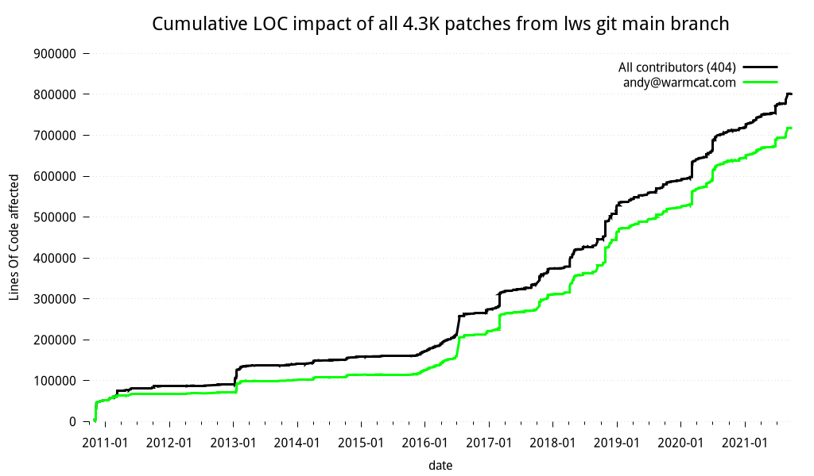

      

# Libwebsockets

Libwebsockets is a simple-to-use, MIT-license, pure C library providing client and server
for **http/1**, **http/2**, **websockets**, **MQTT** and other protocols in a security-minded,
lightweight, configurable, scalable and flexible way.  It's easy to build and
cross-build via cmake and is suitable for tasks from embedded RTOS through mass
cloud serving.

It supports a lot of lightweight ancilliary implementations for things like JSON,
CBOR, JOSE, COSE, and supports OpenSSL and MbedTLS v2 and v3 out of the box for everything.
It's very gregarious when it comes to event loop sharing, supporting libuv, libevent, libev,
sdevent, glib and uloop, as well as custom event libs.

[100+ independent minimal examples](https://libwebsockets.org/git/libwebsockets/tree/minimal-examples) for various scenarios, CC0-licensed
(public domain) for cut-and-paste, allow you to get started quickly.

[There are a lot of READMEs](https://libwebsockets.org/git/libwebsockets/tree/READMEs) on a variety of topics.

[We do a huge amount of CI testing per push](https://libwebsockets.org/sai/), currently 582 builds on 30 platforms.
[You can see the lws CI rack and read about how lws-based Sai is used to coordinate all the testing](https://warmcat.com/2021/08/21/Sai-CI.html).

News
----

## v4.3 is released

See the [changelog](https://libwebsockets.org/git/libwebsockets/tree/changelog)

## Lws work retrospective

The initial commit for lws will have been 11 years ago come Oct 28 2021, it's been a lot of work.
There are a total of 4.3K patches, touching 800KLOC cumulatively (this is not the size in the
repo, but over the years, how many source lines were changed by patches).

Gratifyingly, it turns out over the years, ~15% of that was contributed by 404 contributors: that's not so bad.
Thanks a lot to everyone who has provided patches.

Today at least tens of millions of devices and product features rely on lws to
handle their communications including several from FAANG; Google now include lws
as part of Android sources.

## Support

This is the libwebsockets C library for lightweight websocket clients and
servers.  For support, visit

 https://libwebsockets.org

and consider joining the project mailing list at

 https://libwebsockets.org/mailman/listinfo/libwebsockets

You can get the latest version of the library from git:

- https://libwebsockets.org/git

Doxygen API docs for development: https://libwebsockets.org/lws-api-doc-main/html/index.html

