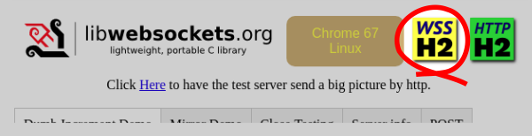

    

# Libwebsockets

Libwebsockets is a simple-to-use, pure C library providing client and server
for **http/1**, **http/2**, **websockets** and other protocols in a security-minded,
lightweight, configurable, scalable and flexible way.  It's easy to build and
cross-build via cmake and is suitable for tasks from embedded RTOS through mass
cloud serving.

[50 minimal examples](https://libwebsockets.org/git/libwebsockets/tree/minimal-examples) for
various scenarios, CC0-licensed (public domain) for cut-and-paste, allow you to get started quickly.

News
----

## V3.2 relase last planned LGPLv2.1+SLE release

As foretold the v3.2 release is the last planned release that will have the code
under LGPLv2.1+SLE.  Master has those parts changed to MIT license; the pieces
that were CC0 or another liberal license remain the same.

## License change plan

Lws is planning to change the pieces that are currently LGPLv2.1+SLE to MIT
https://opensource.org/licenses/MIT .  Stuff that is already CC0 or another
permissive license will stay as it is.

This license change is making an already permissive license (it was already LGPL,
and the SLE removed most restrictions already) even more permissive.
So I expect most contributors either don't much care or are happy about it.
Contributors who object should contact me via:

 - the lws mailing list https://libwebsockets.org/mailman/listinfo/libwebsockets
 - github issue https://github.com/warmcat/libwebsockets , or
 - email to `andy@warmcat.com`

...before **Aug 11 2019**, and I'll rewrite the related code before the change.
There'll be a last release of the currently-licensed stuff (probably v3.2) and
then the same code will have the licese grant changed in the sources, become
master and also have an otherwise identical release, probably v4.0.  The v3.2
stuff won't be maintained (by me anyway... it's FOSS though) but the v4.0
stuff which is the same except the license will get the usual v4.0-stable
treatment.

Even after the change I will continue to rely on users to help me with bug
reports and patches, work together on new features.  The license will no
longer require it but the practical advantages from staying aligned with
upstream lws for users remain the same.

## New features on master

 - `LWS_WITH_NETWORK` cmake option (default on) allows one-step removal of vhost,
   wsi, roles, event loop and all network-related code from the build.  This
   enables use-cases where you actually need unrelated features like JOSE or FTS
   compactly.  lws_context still exists and if tls is enabled, the tls-related code
   is still built so the crypto is available, just nothing related to network.

 - New Crypto-agile APIs + JOSE / JWS / JWE / JWK support... apis work exactly
   the same with OpenSSL or mbedTLS tls library backends, and allow key cycling
   and crypto algorithm changes while allowing for grace periods

   [README.crypto-apis](https://libwebsockets.org/git/libwebsockets/tree/READMEs/README.crypto-apis.md)

 - CMake config simplification for crypto: `-DLWS_WITH_GENCRYPTO=1` for all
   generic cipher and hash apis built (which work the same on mbedtls and
   OpenSSL transparently), and `-DLWS_WITH_JOSE=1` for all JOSE, JWK, JWS
   and JWE support built (which use gencrypto and so also work the same
   regardless of tls library backend).

 - **`x.509`** - new generic x509 api allows PEM-based certificate and key
   trust relationship verification, and conversion between x.509 keys and
   JWK.  Works for EC and RSA keys, and on mbedtls and OpenSSl the same.

   [x.509 api](https://libwebsockets.org/git/libwebsockets/tree/include/libwebsockets/lws-x509.h), 
   [x.509 minimal example](https://libwebsockets.org/git/libwebsockets/tree/minimal-examples/crypto/minimal-crypto-x509)

 - **`JWE`** - JWE (RFC7516) Algorithms with CI tests:

|Key Encryption|Payload authentication + crypt|Enc + Dec Support|
|---|---|---|
|`RSAES-PKCS1-v1.5` 2048b & 4096b|`AES_128_CBC_HMAC_SHA_256`|Enc + Dec|
|`RSAES-PKCS1-v1.5` 2048b|`AES_192_CBC_HMAC_SHA_384`|Enc + Dec|
|`RSAES-PKCS1-v1.5` 2048b|`AES_256_CBC_HMAC_SHA_512`|Enc + Dec|
|`RSAES-OAEP`|`AES_256_GCM`|Enc + Dec|
|`AES128KW`, `AES192KW`, `AES256KW`|`AES_128_CBC_HMAC_SHA_256`|Enc + Dec|
|`AES128KW`, `AES192KW`, `AES256KW`|`AES_192_CBC_HMAC_SHA_384`|Enc + Dec|
|`AES128KW`, `AES192KW`, `AES256KW`|`AES_256_CBC_HMAC_SHA_512`|Enc + Dec|
|`ECDH-ES` (P-256/384/521 key)|`AES_128/192/256_GCM`|Enc + Dec|
|`ECDH-ES+A128/192/256KW` (P-256/384/521 key)|`AES_128/192/256_GCM`|Enc + Dec|

All tests pass on both OpenSSL and mbedTLS backends, using keys generated on
both OpenSSL and mbedTLS in the tests.

A minimal example tool shows how to encrypt and decrypt compact JWE objects
from the commandline for all supported algorithms.

   [jwe api](https://libwebsockets.org/git/libwebsockets/tree/include/libwebsockets/lws-jwe.h), 
   [jwe unit tests](https://libwebsockets.org/git/libwebsockets/tree/minimal-examples/api-tests/api-test-jose/jwe.c), 
   [jwe minimal example](https://libwebsockets.org/git/libwebsockets/tree/minimal-examples/crypto/minimal-crypto-jwe)

 - **`lws-genec` ECDSA** - JWS-compatible ECDSA is supported on both OpenSSL and mbedtls.

 - **`JWS`** - JWS (RFC7515) is now supported for none, HS256/384/512, RS256/384/512, and ES256/384/512, on both OpenSSL and mbedtls.  There's a minimal example tool that signs and verifies compact
 representation JWS from stdin.
   [jws api](https://libwebsockets.org/git/libwebsockets/tree/include/libwebsockets/lws-jws.h), 
   [jws unit tests](https://libwebsockets.org/git/libwebsockets/tree/minimal-examples/api-tests/api-test-jose/jws.c), 
   [jws minimal example](https://libwebsockets.org/git/libwebsockets/tree/minimal-examples/crypto/minimal-crypto-jwe)

 - **`JWK`** - JWK (RFC7517) now supports oct, RSA and EC keys including JSON key
   arrays on both OpenSSL and mbedtls.  A minimal example tool shows how to create
   new JSON JWK keys to specified parameters from the commandline for all supported
   ciphers.

   [jwk minimal example](https://libwebsockets.org/git/libwebsockets/tree/minimal-examples/crypto/minimal-crypto-jwk)

 - **`lws-genrsa` OAEP + PSS support** - in addition to PKCS#1 1.5 padding, OAEP and PSS are
   now supported on both mbedtls and openssl backends.

 - **`lws-genaes` Generic AES crypto** - thin api layer works identically with both mbedtls and openssl
   backends.  Supports CBC, CFB128, CFB8, CTR, ECB, OFB, XTS and GCM variants.  Unit tests in CI.
   [genaes api](https://libwebsockets.org/git/libwebsockets/tree/include/libwebsockets/lws-genaes.h),
   [api test](https://libwebsockets.org/git/libwebsockets/tree/minimal-examples/api-tests/api-test-gencrypto),
   CMake config: `-DLWS_WITH_GENCRYPTO=1`

 - **http fallback support** - you can specify a role and protocol to apply if non-http or non-tls
   packets arrive at an http(s) listen port.  For example, you can specify that the new `raw proxy`
   role + protocol should be used, to proxy your sshd port over :443 or :80.  Without affecting
   normal http(s) serving on those ports but allowing, eg, `ssh -p 443 invalid@libwebsockets.org`.
   [http fallback docs](https://libwebsockets.org/git/libwebsockets/tree/READMEs/README.http-fallback.md)

 - **raw tcp proxy role and protocol** - adding raw tcp proxying is now trivial using the built-in lws
   implementation.  You can control the onward connection using a pvo in the format "ipv4:server.com:port"
   [raw proxy minimal example](https://libwebsockets.org/git/libwebsockets/tree/minimal-examples/raw/minimal-raw-proxy),
   [raw proxy docs](https://libwebsockets.org/git/libwebsockets/tree/plugins/raw-proxy),
   Cmake config: `-DLWS_ROLE_RAW_PROXY=1 -DLWS_WITH_PLUGINS=1`

 - **deaddrop HTML file upload protocol** - protocol and minimal example for file upload and sharing using
   drag and drop and a file picker.  Integrated with basic auth, uploaded files marked with upload user,
   and files owned by the authenticated user may be deleted via the UI.  Supports multiple simultaneous
   uploads both by drag-and-drop and from the file picker.
   [deaddrop minimal example](https://libwebsockets.org/git/libwebsockets/tree/minimal-examples/http-server/minimal-http-server-deaddrop)

 - **basic auth for ws(s)** - You can apply basic auth credential requirement to ws connections same
   as on mounts now.  Just add a pvo "basic-auth" with the value being the credentials file path when
   enabling the ws protocol for the vhost.

## v3.1 released: new features in v3.1

 - **lws threadpool** - lightweight pool of pthreads integrated to lws wsi, with all
   synchronization to event loop handled internally, queue for excess tasks
   [threadpool docs](https://libwebsockets.org/git/libwebsockets/tree/lib/misc/threadpool), 
   [threadpool minimal example](https://libwebsockets.org/git/libwebsockets/tree/minimal-examples/ws-server/minimal-ws-server-threadpool), 
   Cmake config: `-DLWS_WITH_THREADPOOL=1`

 - **libdbus support** integrated on lws event loop
   [lws dbus docs](https://libwebsockets.org/git/libwebsockets/tree/lib/roles/dbus), 
   [lws dbus client minimal examples](https://libwebsockets.org/git/libwebsockets/tree/minimal-examples/dbus-client), 
   [lws dbus server minimal examples](https://libwebsockets.org/git/libwebsockets/tree/minimal-examples/dbus-server), 
   Cmake config: `-DLWS_ROLE_DBUS=1`

 - **lws allocated chunks (lwsac)** - helpers for optimized mass allocation of small
   objects inside a few larger malloc chunks... if you need to allocate a lot of
   inter-related structs for a limited time, this removes per-struct allocation
   library overhead completely and removes the need for any destruction handling
   [lwsac docs](https://libwebsockets.org/git/libwebsockets/tree/lib/misc/lwsac), 
   [lwsac minimal example](https://libwebsockets.org/git/libwebsockets/tree/minimal-examples/api-tests/api-test-lwsac), 
   Cmake Config: `-DLWS_WITH_LWSAC=1`

 - **lws tokenizer** - helper api for robustly tokenizing your own strings without
   allocating or adding complexity.  Configurable by flags for common delimiter
   sets and comma-separated-lists in the tokenizer.  Detects and reports syntax
   errors.
   [lws_tokenize docs](https://libwebsockets.org/git/libwebsockets/tree/include/libwebsockets/lws-tokenize.h), 
   [lws_tokenize minimal example / api test](https://libwebsockets.org/git/libwebsockets/tree/minimal-examples/api-tests/api-test-lws_tokenize)

 - **lws full-text search** - optimized trie generation, serialization,
   autocomplete suggestion generation and instant global search support extensible
   to huge corpuses of UTF-8 text while remaining super lightweight on resources.
   [full-text search docs](https://libwebsockets.org/git/libwebsockets/tree/lib/misc/fts), 
   [full-text search minimal example / api test](https://libwebsockets.org/git/libwebsockets/tree/minimal-examples/api-tests/api-test-fts), 
   [demo](https://libwebsockets.org/ftsdemo/), 
   [demo sources](https://libwebsockets.org/git/libwebsockets/tree/plugins/protocol_fulltext_demo.c), 
   Cmake config: `-DLWS_WITH_FTS=1 -DLWS_WITH_LWSAC=1`

 - **gzip + brotli http server-side compression** - h1 and h2 detection of client support
   for server compression, and auto-application to files with mimetypes "text/*",
   "application/javascript" and "image/svg.xml".
   Cmake config: `-DLWS_WITH_HTTP_STREAM_COMPRESSION=1` for gzip, optionally also give
   `-DLWS_WITH_HTTP_BROTLI=1` for preferred `br` brotli compression

 - **managed disk cache** - API for managing a directory containing cached files
   with hashed names, and automatic deletion of LRU files once the cache is
   above a given limit.
   [lws diskcache docs](https://libwebsockets.org/git/libwebsockets/tree/include/libwebsockets/lws-diskcache.h), 
   Cmake config: `-DLWS_WITH_DISKCACHE=1`

 - **http reverse proxy** - lws mounts support proxying h1 or h2 requests to
   a local or remote IP, or unix domain socket over h1.  This allows microservice
   type architectures where parts of the common URL space are actually handled
   by external processes which may be remote or on the same machine.
   [lws gitohashi serving](https://libwebsockets.org/git/) is handled this way.
   [unix domain sockets reverse proxy docs](https://libwebsockets.org/git/libwebsockets/tree/READMEs/README.unix-domain-reverse-proxy.md), 
   CMake config: `-DLWS_WITH_HTTP_PROXY=1` and `-DLWS_UNIX_SOCK=1` for Unix Domain Sockets

 - **update minimal examples for strict Content Security Policy** the minimal
   examples now show the best practices around Content Security Policy and
   disabling inline Javascript.  Updated examples that are served with the
   recommended security restrictions show a new "Strict Content Security Policy"
   graphic.  [Read how to upgrade your applications to use a strict CSP](https://libwebsockets.org/git/libwebsockets/tree/READMEs/README.content-security-policy.md).

 - **release policy docs** - unsure what branch, version or tag to use, or how
   to follow master cleanly?  [Read the release policy docs](https://libwebsockets.org/git/libwebsockets/tree/READMEs/README.release-policy.md)
   which explain how and why lws is developed, released and maintained.

## v3.0.1 released

See the git log for the list of fixes.

## v3.0.0 released

See the changelog for info https://libwebsockets.org/git/libwebsockets/tree/changelog?h=v3.0-stable

## Major CI improvements for QA

The Travis build of lws done on every commit now runs:

Tests|Count|Explanation
---|---|---
Build / Linux / gcc|16|-Wall -Werror cmake config variants
Build / Mac / Clang|16|-Wall -Werror cmake config variants
Build / Windows / MSVC|7|default
Selftests|openssl:43, mbedtls:43|minimal examples built and run against each other and remote server
attack.sh|225|Correctness, robustness and security tests for http parser
Autobahn Server|480|Testing lws ws client, including permessage-deflate
Autobahn Client|480|Testing lws ws server, including permaessage-deflate
h2spec|openssl:146, mbedtls:146|Http/2 server compliance suite (in strict mode)
h2load|openssl:6, mbedtls:6|Http/2 server load tool (checks 10K / 100K in h1 and h2, at 1, 10, 100 concurrency)
h2load SMP|6|Http/2 and http/1.1 server load checks on SMP server build

The over 1,500 tests run on every commit take 1hr 15 of compute time to complete.
If any problems are found, it breaks the travis build, generating an email.

Codacy also checks every patch and the information used to keep lws at zero issues.

Current master is checked by Coverity at least daily and kept at zero issues.

Current master passes all the tests and these new CI arrangements will help
keep it that way.

## Lws has the first official ws-over-h2 server support

There's a new [RFC](https://tools.ietf.org/html/rfc8441) that enables multiplexing ws connections
over an http/2 link.  Compared to making individual tcp and tls connections for
each ws link back to the same server, this makes your site start up radically
faster, and since all the connections are in one tls tunnel, with considerable memory
reduction serverside.

To enable it on master you just need -DLWS_WITH_HTTP2=1 at cmake.  No changes to
existing code are necessary for either http/2 (if you use the official header creation
apis if you return your own headers, as shown in the test apps for several versions)
or to take advantage of ws-over-h2.  When built with http/2 support, it automatically
falls back to http/1 and traditional ws upgrade if that's all the client can handle.

Currently only Chrome Canary v67 supports this ws-over-h2 encapsulation (chrome
must be started with `--enable-websocket-over-http2` switch to enable it currently),
and patches exist for Firefox.  Authors of both browser implementations tested
against the lws server implementation.

## New "minimal examples"

https://libwebsockets.org/git/libwebsockets/tree/minimal-examples

These are like the test apps, but focus on doing one thing, the best way, with the
minimum amount of code.  For example the minimal-http-server serves the cwd on
http/1 or http/2 in 50 LOC.  Same thing with tls is just three more lines.

They build standalone, so it's easier to copy them directly to start your own project; they
are CC0 licensed (public domain) to facilitate that.

## Windows binary builds

32- and 64-bit Windows binary builds are available via Appveyor.  Visit
[lws on Appveyor](https://ci.appveyor.com/project/lws-team/libwebsockets),
click on a build, the ARTIFACTS, and unzip the zip file at `C:\Program Files (x86)/libwebsockets`.

## Support

This is the libwebsockets C library for lightweight websocket clients and
servers.  For support, visit

 https://libwebsockets.org

and consider joining the project mailing list at

 https://libwebsockets.org/mailman/listinfo/libwebsockets

You can get the latest version of the library from git:

- https://libwebsockets.org/git

Doxygen API docs for master: https://libwebsockets.org/lws-api-doc-master/html/index.html

