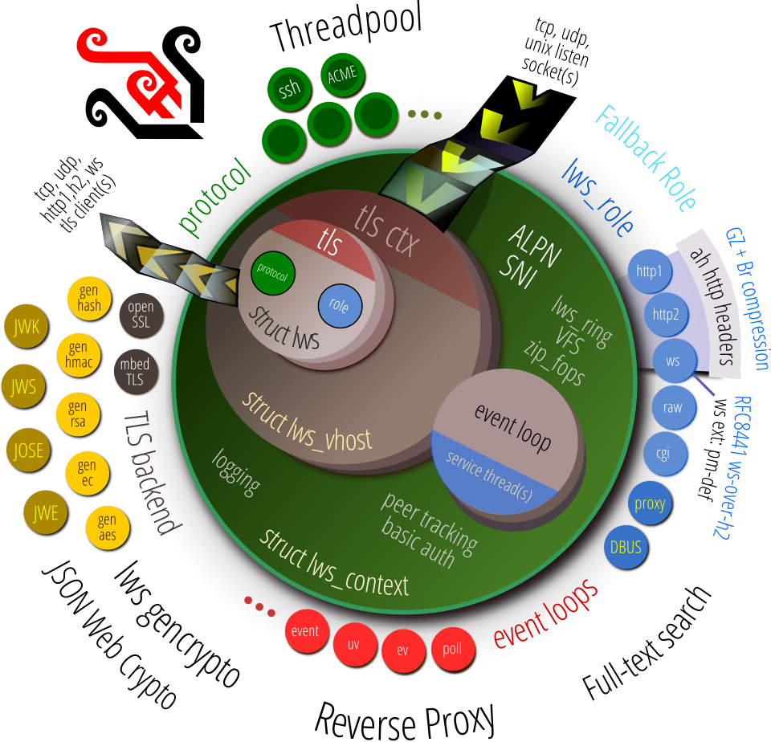

   

# Libwebsockets

Libwebsockets is a simple-to-use, MIT-license, pure C library providing client and server
for **http/1**, **http/2**, **http/3**, **websockets**, **webtransport**, **MQTT** and
other protocols in a security-minded, lightweight, configurable, scalable and flexible way.
It's easy to build and cross-build via cmake and is suitable for tasks from embedded RTOS
through mass cloud serving.

It supports a lot of lightweight ancilliary implementations for things like JSON,
CBOR, JOSE, COSE, and supports OpenSSL and MbedTLS v2/3/4 out of the box for everything.
It's very gregarious when it comes to event loop sharing, supporting libuv, libevent, libev,
sdevent, glib and uloop, as well as custom event libs.

[100+ independent minimal examples](https://libwebsockets.org/git/libwebsockets/tree/minimal-examples) for various scenarios, CC0-licensed
(public domain) for cut-and-paste, allow you to get started quickly.

[There are a lot of READMEs](https://libwebsockets.org/git/libwebsockets/tree/READMEs) on a variety of topics.
[Doxygen API docs](https://libwebsockets.org/lws-api-doc-main/html/index.html)

[We do a huge amount of CI testing per push](https://libwebsockets.org/sai/)

V5.0 now available... please upgrade to this as there are many
security fixes only available on v5.0 and main.

** NEW features available on v5.0 **

 - Support for SChannel (windows native TLS, no need for OpenSSL build!), GnuTLS, openHiTLS and BearSSL added
 - QUIC + H3 + Webtransport implementation, using aws-lc, wolfssl, boringssl, libressl, gnutls, and schannel (OpenSSL is h1/h2 -only; mbedtls can do it via a patch)
 - WebRTC mixing (like your own zoom)
 - HLS serving

|LWS version|Platform|Protocols|Default TLS|
|---|---|---|---|
|<= 4.5|non-FreeRTOS|any|OpenSSL|
|<= 4.5|FreeRTOS|any|mbedTLS|
|5.0+|Windows|any|schannel|
|5.0+|*nix|h1, h2|OpenSSL|
|5.0+|*nix|quic/h3|GnuTLS|
|5.0+|FreeRTOS|any|mbedTLS|

quic/h3 is enabled for build by default... necessitating GnuTLS instead of OpenSSL to make quic/h3 work.

| TLS Library | Server TLS | Client TLS | QUIC Transport (TLS 1.3) | WSS / HTTPS | MQTT over TLS | ALPN (HTTP/2) | DTLS (WebRTC) | Session Cache | JIT Trust | GenCrypto |
| :--- | :---: | :---: | :---: | :---: | :---: | :---: | :---: | :---: | :---: | :---: |
| **GnuTLS**    | **Yes** | **Yes** | **Yes** | **Yes** | **Yes** | **Yes** | **Yes** | **Yes** | **No** | **Yes** |
| **OpenSSL**   | **Yes** | **Yes** | **No*** | **Yes** | **Yes** | **Yes** | **Yes** | **Yes** | **Yes** | **Yes** |
| **LibreSSL**  | **Yes** | **Yes** | **Yes** | **Yes** | **Yes** | **Yes** | **Yes** | **Yes** | **No** | **Yes** |
| **AWS-LC**    | **Yes** | **Yes** | **Yes** | **Yes** | **Yes** | **Yes** | **Yes** | **Yes** | **No** | **Yes** |
| **BoringSSL** | **Yes** | **Yes** | **Yes** | **Yes** | **Yes** | **Yes** | **Yes** | **Yes** | **No** | **Yes** |
| **wolfSSL**   | **Yes** | **Yes** | **Yes** | **Yes** | **Yes** | **Yes** | **Yes** | **Yes** | **No** | **Yes** |
| **mbedTLS**   | **Yes** | **Yes** | Needs patch | **Yes** | **Yes** | **Yes** | **Yes** | **Yes** | **Yes** | **Yes** |
| **SChannel**  | **Yes** | **Yes** | **Yes** | **Yes** | **Yes** | **Yes** | **Yes** | **Yes** | **No** | **Yes** |
| **BearSSL**   | **Yes** | **Yes** | **No** | **Yes** | **Yes** | **Yes** | **No** | **Yes** | **Yes** | **Yes** |
| **openHiTLS** | **Yes** | **Yes** | **No** | **Yes** | **Yes** | **Yes** | Yes (not SRTP) | **Yes** | **Yes** | **Yes** |

\* *Note: 1) Upstream OpenSSL does not provide the necessary QUIC TLS API (`SSL_set_quic_method`) to act as a cryptographic engine for LWS's QUIC transport. If you need QUIC/HTTP3 support, we recommend using BoringSSL or GnuTLS.*
\* *Note: 2) openHiTLS does not provide the necessary QUIC TLS API *

 - DHT support built-in: `-DLWS_WITH_DHT=1`

