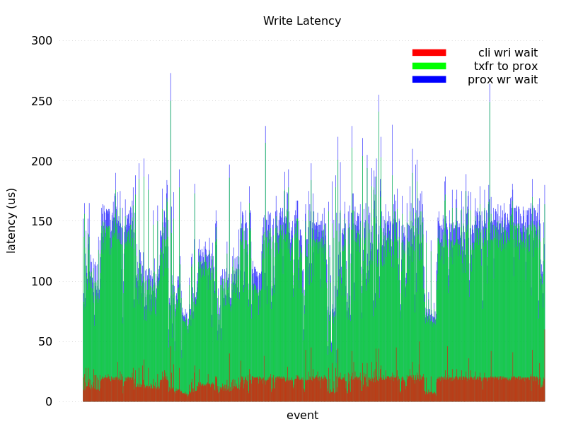

# lws detailed latency



## Introduction

lws has the capability to make detailed latency measurements and
report them in realtime to a specified callback.

A default callback is provided that renders the data as text in
space-separated format suitable for gnuplot, to a specified file.

## Configuring

Enable `LWS_WITH_DETAILED_LATENCY` at cmake.

Create your context with something similar to this

```
#if defined(LWS_WITH_DETAILED_LATENCY)
	info.detailed_latency_cb = lws_det_lat_plot_cb;
	info.detailed_latency_filepath = "/tmp/lws-latency-results";
#endif
```

`lws_det_lat_plot_cb` is provided by lws as a convenience to convert
the stuct data provided at the callback interface to space-separated
text data that is easy to process with shell commands and gnuplot.

## `lws_det_lat_plot_cb` format

```
728239173547 N 23062 0 0 23062 0 0 0
728239192554 C 18879 0 0 18879 0 0 0
728239217894 T 25309 0 0 25309 0 0 0
728239234998 r 0 0 0 0 271 172 256
728239250611 r 0 0 0 0 69 934 4096
728239255679 w 19 122 18 159 20 80 80
728239275718 w 20 117 15 152 18 80 80
728239295578 w 10 73 7 90 7 80 80
728239315567 w 9 67 5 81 7 80 80
728239335745 w 23 133 9 165 14 80 80
...
```

Each event is shown in 9 columns

 - unix time in us
 - event type
   - N = Name resolution
   - C = TCP Connection
   - T = TLS negotiation server
   - t = TLS negotiation client
   - r = Read
   - w = Write
 - us duration, for w time client spent waiting to write
 - us duration, for w time data spent in transit to proxy
 - us duration, for w time proxy waited to send data
 - as a convenience, sum of last 3 columns above
 - us duration, time spent in callback
 - last 2 are actual / requested size in bytes

## Processing captured data with ministat

Eg, to summarize overall latencies on all captured writes

```
 $ cat /tmp/lws-latency-results | grep " w " | cut -d' ' -f6 | ministat
...
    N           Min           Max        Median           Avg        Stddev
x 1000            43           273           141       132.672     32.471693
```

## Processing captured data with gnuplot

### Gnuplot plotting script

Create a gnuplot script, eg myscript.gp

```
reset
set term pngcairo enhanced nocrop font "OpenSans, 12" size 800,600#output terminal and file
set output "lws-latency.png"
#set yrange [0:10000]
#to put an empty boundary around the
#data inside an autoscaled graph.
set offset graph 0.05,0.05,0.05,0.0
set style fill transparent solid 0.5 #fillstyle
set tics out nomirror
set xlabel "event"
set ylabel "latency (us)"
set format x ""
set title "Write latency"
set key invert reverse Right inside nobox
set key autotitle columnheader
set style data histogram
set style histogram rowstacked
set style fill solid border -1
set boxwidth 0.75
set style fill solid 1.00 noborder
set tic scale 0
set grid ytics lc rgb "#505050"
unset border
unset xtics

plot '/tmp/1' \
	   using ($3 + $4 + $5):xtic(1)         w boxes lt rgbcolor "blue"  title 'prox wr wait', \
	'' using ($3 + $4):xtic(1)         w boxes lt rgbcolor "green" title 'txfr to prox', \
	'' using 3:xtic(1) w boxes lt rgbcolor "red"   title 'cli wri wait'
```

### gnuplot invocation

```
 $ cat /tmp/lws-latency-results | grep " w " \>/tmp/1 ; gnuplot myscript.gp && eog lws-latency.png
```

