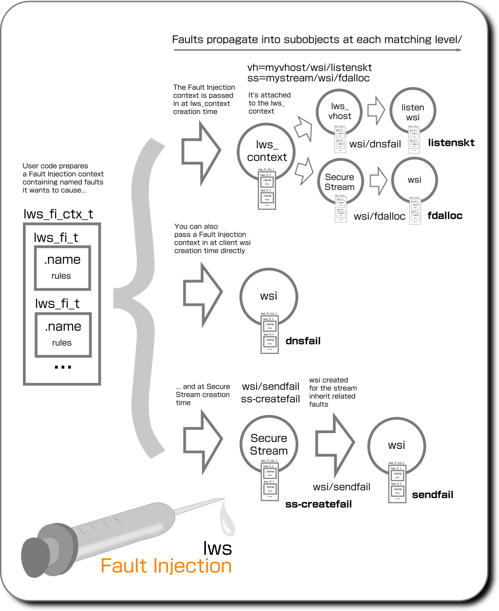

# `lws_fi` Fault Injection

Most efforts during development go towards trying to make the system do what
it is supposed to do during normal operation.

But to provide reliable quality there's a need to not just test the code paths
for normal operation, but also to be able to easily confirm that they act
correctly under various fault conditions that may be difficult to arrange at
test-time. It's otherwise very easy for error conditions that are low
probability to be overlooked and turn out to do the wrong thing, eg, try to
clean up things they had not actually initialized, or forget to free things etc.

Code handling the operational failures we want to check may be anywhere,
including during early initialization or in user code before lws intialization.

To help with this lws has a `LWS_WITH_SYS_FAULT_INJECTION` build option that
provides a simple but powerful api for targeted fault injection in any lws or
user code, and provides a wide range of well-known internal faults inside lws
you can trigger from outside.

## Fault contexts and faults

The basic idea is objects in the user code can choose to initialize "fault
contexts" inside objects, that list named, well-known "faults" that the code
supoorts and that the user wants to inject.

Although these "fault contexts" can be embedded in objects directly at object
creation time, eg, for lws in the lws_context creation info struct, or the
client connection info struct, or Secure Stream info struct, it's usually
inconvenient to pass the desired faults directly deep into the code and attach
them at creation time.  Eg, if you want to cause a fault in a wsi instantiated
by a Secure Stream, that is internal lws code one step removed from the Secure
Stream object creation making it difficult to arrange.

For that reason, faults have a targeted inheritance scheme using namespace
paths, it's usually enough to just list the faults you want at context creation
time and they will be filter down to the internal objects you want to target
when they are created later.



A fault injection request is made in `lws_fi_t` objects, specifying the
fault name and whether, and how often to inject the fault.

The "fault context" objects `lws_fi_ctx_t` embedded in the creation info
structs are linked-lists of `lws_fi_t` objects.  When Fault Injection is enabled
at build-time, the key system objects like the `lws_context`, `lws_vhost`, `wsi`
and Secure Stream handles / SSPC handles contain their own `lws_fi_ctx_t` lists
that may have any number of `lws_fi_t` added to them.

When downstream objects are created, eg, when an lws_context creates a Secure
Stream, in addition to using any faults provided directly in the SS info,
the lws_context faults are consulted to see if any relate to that streamtype
and should be applied.

Although faults can be added to objects at creation, it is far more convenient
to just pass a list of faults you want into the lws_context and have the
objects later match them using namespacing, described later.

## Integrating fault injection conditionals into code in private lws code

A simple query api `lws_fi(fi_ctx, "name")` is provided that returns 0 if no
fault to be injected, or 1 if the fault should be synthesized.  If there is no
rule matching "name", the answer is always to not inject a fault, ie, returns 0.

Similarly for convenience if FAULT_INJECTION is disabled at build, the `lws_fi()`
call always returns the constant `0`.

By default then just enabling Fault Injection at build does not have any impact
on code operation since the user must also add the fault injection rules he
wants to the objects's Fault Injection context.

## Integrating fault injection conditionals into user code with public apis

These public apis query the fault context in a wsi, lws_context, ss handle, or
sspc handle (client side of proxy) to find any matching rule, if so they return
1 if the conditions (eg, probability) are met and the fault should be injected.

These allow user code to use the whole Fault Injection system without having to
understand anything except the common object like a wsi they want to query and
the name of the fault rule they are checking.

|FI context owner|Public API|
|---|---|
|lws_context|`int lws_fi_user_context_fi(struct lws_context *ctx, const char *rule)`|
|wsi|`int lws_fi_user_wsi_fi(struct lws *wsi, const char *rule)`|
|ss handle|`int lws_fi_user_ss_fi(struct lws_ss_handle *h, const char *rule)`|
|sspc handle|`int lws_fi_user_sspc_fi(struct lws_sspc_handle *h, const char *rule)`|

For example, the minimal-http-client user code example contains this in its
ESTABLISHED callback

```
		if (lws_fi_user_wsi_fi(wsi, "user_reject_at_est"))
			return -1;
```

which can be triggered by running it with

`lws-minimal-http-client --fault-injection 'wsi/user_reject_at_est'`, causing

```
...
[2021/03/11 13:41:05:2769] U: Connected to 46.105.127.147, http response: 200
[2021/03/11 13:41:05:2776] W: lws_fi: Injecting fault unk->user_reject_at_est
[2021/03/11 13:41:05:2789] E: CLIENT_CONNECTION_ERROR: HS: disallowed at ESTABLISHED
...
```

When `LWS_WITH_SYS_FAULT_INJECTION` is disabled, these public apis become
preprocessor defines to `(0)`, so the related code is removed by the compiler.

## Types of fault injection "when" strategy

The api keeps track of each time the context was asked and uses this information
to drive the decision about when to say yes, according to the type of rule

|Injection rule type|Description|
|---|---|
|`LWSFI_ALWAYS`|Unconditionally inject the fault|
|`LWSFI_DETERMINISTIC`|after `pre` times without the fault, the next `count` times exhibit the fault`|
|`LWSFI_PROBABILISTIC`|exhibit a fault `pre` percentage of the time|
|`LWSFI_PATTERN`|Reference `pre` bits pointed to by `pattern` and fault if the bit set, pointing to static array|
|`LWSFI_PATTERN_ALLOC`|Reference `pre` bits pointed to by `pattern` and fault if the bit set, pointing to allocated array, freed when fault goes out of scope|

Probabalistic choices are sourced from a PRNG with a seed set in the context
creation info Fault Injection Context.  By default the lws helper
`lws_cmdline_option_handle_builtin()` sets this to the time in us, but it can
be overridden using `--fault-seed <decimal>`, and the effective PRNG seed is
logged when the commandline options are initially parsed.

## Addings Fault Injection Rules to `lws_fi_ctx_t`

Typically the lws_context is used as the central, toplevel place to define
faults.  This is done by adding prepared `lws_fi_t` objects on the stack one by
one to the context creation info struct's `.fic` member, using
`lws_fi_add(lws_fi_ctx_t *fic, const lws_fi_t *fi);`, this will allocate and copy
the provided `fi` into the allocation, and attach it to the `lws_fi_ctx_t` list.

When the context (or other object using the same scheme) is created, it imports
all the faults from the info structure `.fic` and takes ownership of them,
leaving the info `.fic` empty and ready to go out of scope.

## Passing in fault injection rules

A key requirement is that Fault Injection rules must be availble to the code
creating an object before the object has been created.  This is why the user
code prepares a Fault Injection context listing his rules in the creation info
struct, rather than waiting for the object to be created and then attach Fault
Injection rules... it's too late then to test faults during the creation.

## Directly applying fault contexts

You can pass in a Fault Injection context prepared with lws_fi_t added to it
when creating the following kinds of objects

|Object being created|info struct|Fault injection Context member|
|---|---|---|
|lws context|struct lws_context_creation_info|`fic`|
|vhost|struct lws_context_creation_info|`fic`|
|Secure Stream|struct lws_ss_info|`fic`|
|client wsi|struct lws_client_connect_info|`fic`|

However typically the approach is just provide a list of faults at context
creation time, and let the objects match and inherit using namespacing,
described next.

## Using the namespace to target specific instances

Lws objects created by the user can directly have a Fault Injection context
attached to them at creation time, so the fault injection objects directly
relate to the object.

But in other common scenarios, there is no direct visibility of the object that
we want to trigger faults in, it may not exist until some time later.  Eg, we
want to trigger faults in the listen socket of a vhost.  To allow this, the
fault names can be structured with a /path/ type namespace so objects created
later can inherit faults.

Notice that if you are directly creating the vhost, Secure Stream or wsi, you
can directly attach the subrule yourself without the namespacing needed.  The
namespacing is used when you have access to a higher level object at creation-
time, like the lws_context, and it will itself create the object you want to
target without your having any direct access to it.

|namespace form|effect|
|---|---|
|**vh=myvhost/**subrule|subrule is inherited by the vhost named "myvhost" when it is created|
|**vh/**subrule|subrule is inherited by any vhost when it is created|
|**ss=mystream/**subrule|subrule is inherited by SS of streamtype "mystream" (also covers SSPC / proxy client)|
|**ss/**subrule|subrule is inherited by all SS of any streamtype (also covers SSPC / proxy client)|
|**wsi=myname/**subrule|subrule is inherited by client wsi created with `info->fi_wsi_name` "myname"|
|**wsi/**subrule|subrule is inherited by any wsi|

Namespaces can be combined, for example `vh=myvhost/wsi/listenskt` will set the
`listenskt` fault on wsi created by the server vhost "myvhost", ie, it will
cause the listen socket for the vhost to error out on creation.

In the case of wsi migration when it's the network connection wsi on an h2
connection that is migrated to be SID 1, the attached faults also migrate.

Here is which Fault Injection Contexts each type of object inherits matching
Fault Injection rules from:

|Object type|Initialized with|Inherit matching faults from|
|---|---|---|
|context|`struct lws_context_creation_info` .fic|-|
|vhost|`struct lws_context_creation_info` .fic|context FIC|
|client wsi|`struct lws_client_connect_info` .fic|context FIC, vhost FIC|
|ss / sspc|`lws_ss_info_t` .fic|context FIC|
|ss / sspc wsi|-|context FIC, vhost FIC, ss / sspc .fic|

Since everything can be reached from the lws_context fault context, directly or
by additional inheritence, and that's the most convenient to set from the
outside, that's typically the original source of all injected faults.

## Integration with minimal examples

All the minimal examples that use the `lws_cmdline_option_handle_builtin()` api
can take an additional `--fault-injection "...,..."` switch, which automatically
parses the comma-separated list in the argument to add faults with the given
name to the lws_context.  For example,

`lws-minimal-http-client --fault-injection "wsi/dnsfail"`

will force all wsi dns lookups to fail for that run of the example.

### Specifying when to inject the fault

By default, if you just give the name part, if the namespace is absent or
matches an object, the fault will be injected every time.  It's also possible
to make the fault inject itself at a random probability, or in a cyclic pattern,
by giving additional information in brackets, eg

|Syntax|Used with|Meaning|
|---|---|---|
|`wsi/thefault`|lws_fi()|Inject the fault every time|
|`wsi/thefault(10%)`|lws_fi()|Randomly inject the fault at 10% probability|
|`wsi/thefault(.............X.X)`|lws_fi()|Inject the fault on the 14th and 16th try, every 16 tries|
|`wsi/thefault2(123..456)`|lws_fi_range()|Pick a number between 123 and 456|

You must quote the strings containing these symbols, since they may otherwise be
interpreted by your shell.

The last example above does not decide whether to inject the fault via `lws_fi()`
like the others.  Instead you can use it via `lws_fi_range()` as part of the
fault processing, on a secondary fault injection name.  For example you may have
a fault `myfault` you use with `lws_fi()` to decide when to inject the fault,
and then a second, related fault name `myfault_delay` to allow you to add code
to delay the fault action by some random amount of ms within an externally-
given range.  You can get a pseudo-random number within the externally-given
range by calling `lws_fi_range()` on `myfault_delay`, and control the whole
thing by giving, eg, `"myfault(10%),myfault_delay(123..456)"`

## Well-known fault names in lws

|Scope|Namespc|Name|Fault effect|
|---|---|---|---|
|context||`ctx_createfail1`|Fail context creation immediately at entry|
|context||`ctx_createfail_plugin_init`|Fail context creation as if a plugin init failed (if plugins enabled)|
|context||`ctx_createfail_evlib_plugin`|Fail context creation due to event lib plugin failed init (if evlib plugins enabled)|
|context||`ctx_createfail_evlib_sel`|Fail context creation due to unable to select event lib|
|context||`ctx_createfail_oom_ctx`|Fail context creation due to OOM on context object|
|context||`ctx_createfail_privdrop`|Fail context creation due to failure dropping privileges|
|context||`ctx_createfail_maxfds`|Fail context creation due to unable to determine process fd limit|
|context||`ctx_createfail_oom_fds`|Fail context creation due to OOM on fds table|
|context||`ctx_createfail_plat_init`|Fail context creation due to platform init failed|
|context||`ctx_createfail_evlib_init`|Fail context creation due to event lib init failed|
|context||`ctx_createfail_evlib_pt`|Fail context creation due to event lib pt init failed|
|context||`ctx_createfail_sys_vh`|Fail context creation due to system vhost creation failed|
|context||`ctx_createfail_sys_vh_init`|Fail context creaton due to system vhost init failed|
|context||`ctx_createfail_def_vh`|Fail context creation due to default vhost creation failed|
|context||`ctx_createfail_ss_pol1`|Fail context creation due to ss policy parse start failed (if policy enabled)|
|context||`ctx_createfail_ss_pol2`|Fail context creation due to ss policy parse failed (if policy enabled)|
|context||`ctx_createfail_ss_pol3`|Fail context creation due to ss policy set failed (if policy enabled)|
|context||`cache_createfail`|Fail `lws_cache` creation due to OOM|
|context||`cache_lookup_oom`|Fail `lws_cache` lookup due to OOM|
|vhost|`vh`|`vh_create_oom`|Fail vh creation on vh object alloc OOM|
|vhost|`vh`|`vh_create_oom`|Fail vh creation on vh object alloc OOM|
|vhost|`vh`|`vh_create_pcols_oom`|Fail vh creation at protocols alloc OOM|
|vhost|`vh`|`vh_create_access_log_open_fail`|Fail vh creation due to unable to open access log (LWS_WITH_ACCESS_LOG)|
|vhost|`vh`|`vh_create_ssl_srv`|Fail server ssl_ctx init|
|vhost|`vh`|`vh_create_ssl_cli`|Fail client ssl_ctx init|
|vhost|`vh`|`vh_create_srv_init`|Fail server init|
|vhost|`vh`|`vh_create_protocol_init`|Fail late protocol init (for late vhost creation)|
|srv vhost|`vh=xxx/wsi`|`listenskt`|Causes `socket()` allocation for vhost listen socket to fail|
|cli wsi|`wsi`|`dnsfail`|Sync: `getaddrinfo()` is not called and a EAI_FAIL return synthesized, Async: request not started and immediate fail synthesized|
|cli wsi|`wsi`|`sendfail`|Attempts to send data on the wsi socket fail|
|cli wsi|`wsi`|`connfail`|Attempts to connect on the wsi socket fail|
|cli wsi|`wsi`|`createfail`|Creating the client wsi itself fails|
|udp wsi|`wsi`|`udp_rx_loss`|Drop UDP RX that was actually received, useful with probabalistic mode|
|udp wsi|`wsi`|`udp_tx_loss`|Drop UDP TX so that it's not actually sent, useful with probabalistic mode|
|srv ss|`ss`|`ss_srv_vh_fail`|Secure Streams Server vhost creation forced to fail|
|cli ss|`ss`|`ss_no_streamtype_policy`|The policy for the streamtype is made to seem as if it is missing|
|sspc|`ss`|`sspc_fail_on_linkup`|Reject the connection to the proxy when we hear it has succeeded, it will provoke endless retries|
|sspc|`ss`|`sspc_fake_rxparse_disconnect_me`|Force client-proxy link parse to seem to ask to be disconnected, it will provoke endless retries|
|sspc|`ss`|`sspc_fake_rxparse_destroy_me`|Force client-proxy link parse to seem to ask to destroy the SS, it will destroy the SS cleanly|
|sspc|`ss`|`sspc_link_write_fail`|Force write on the link to fail, it will provoke endless retries|
|sspc|`ss`|`sspc_create_oom`|Cause the sspc handle allocation to fail as if OOM at creation time|
|sspc|`ss`|`sspc_fail_metadata_set`|Cause the metadata allocation to fail|
|sspc|`ss`|`sspc_rx_fake_destroy_me`|Make it seem that client's user code *rx() returned DESTROY_ME|
|sspc|`ss`|`sspc_rx_metadata_oom`|Cause metadata from proxy allocation to fail|
|ssproxy|`ss`|`ssproxy_dsh_create_oom`|Cause proxy's creation of DSH to fail|
|ssproxy|`ss`|`ssproxy_dsh_rx_queue_oom`|Cause proxy's allocation in the onward SS->P[->C] DSH rx direction to fail as if OOM, this causes the onward connection to disconnect|
|ssproxy|`wsi`|`ssproxy_client_adopt_oom`|Cause proxy to be unable to allocate for new client - proxy link connection object|
|ssproxy|`wsi`|`ssproxy_client_write_fail`|Cause proxy write to client to fail|
|ssproxy|`wsi`|`sspc_dsh_ss2p_oom`|Cause ss->proxy dsh allocation to fail|
|ssproxy|`ss`|`ssproxy_onward_conn_fail`|Act as if proxy onward client connection failed immediately|
|ssproxy|`ss`|`ssproxy_dsh_c2p_pay_oom`|Cause proxy's DSH alloc for C->P payload to fail|
|ss|`ss`|`ss_create_smd`|SMD: ss creation smd registration fail|
|ss|`ss`|`ss_create_vhost`|Server: ss creation acts like no vhost matching typename (only for `!vhost`)|
|ss|`ss`|`ss_create_pcol`|Server: ss creation acts like no protocol given in policy|
|ss|`ss`|`ss_srv_vh_fail`|Server: ss creation acts like unable to create vhost|
|ss|`ss`|`ss_create_destroy_me`|ss creation acts like CREATING state returned DESTROY_ME|
|ss|`ss`|`ss_create_no_ts`|Static Policy: ss creation acts like no trust store|
|ss|`ss`|`ss_create_smd_1`|SMD: ss creation acts like CONNECTING said DESTROY_ME|
|ss|`ss`|`ss_create_smd_2`|SMD: ss creation acts like CONNECTED said DESTROY_ME|
|ss|`ss`|`ss_create_conn`|Nailed up: ss creation client connection fails with DESTROY_ME|
|wsi|`wsi`|`timedclose`|(see next) Cause wsi to close after some time|
|wsi|`wsi`|`timedclose_ms`|Range of ms for timedclose (eg, "timedclose_ms(10..250)"|

## Well-known namespace targets

Namespaces can be used to target these more precisely, for example even though
we are only passing the faults we want inject at the lws_context, we can use
the namespace "paths" to target only the wsis created by other things.

To target wsis from SS-based connections, you can use `ss=stream_type_name/`,
eg for captive portal detection, to have it unable to find its policy entry:

`ss=captive_portal_detect/ss_no_streamtype_policy` (disables CPD from operating)

...to force it to fail to resolve the server DNS:

`ss=captive_portal_detect/wsi/dnsfail` (this makes CPD feel there is no internet)

...to target the connection part of the captive portal testing instead:

`ss=captive_portal_detect/wsi/connfail` (this also makes CPD feel there is no internet)

### Well-known internal wsi type names

Wsi created for internal features like Async DNS processing can also be targeted

|wsi target|Meaning|
|---|---|
|`wsi=asyncdns/`|UDP wsi used by lws Async DNS support to talk to DNS servers|
|`wsi=dhcpc/`|UDP wsi used by lws DHCP Client|
|`wsi=ntpclient/`|UDP wsi used by lws NTP Client|

For example, passing in at lws_context level `wsi=asyncdns/udp_tx_loss`
will force async dns to be unable to resolve anything since its UDP tx is
being suppressed.

At client connection creation time, user code can also specify their own names
to match on these `wsi=xxx/` namespace parts, so the faults only apply to
specific wsi they are creating themselves later.  This is done by setting the
client creation info struct `.fi_wsi_name` to the string "xxx".
