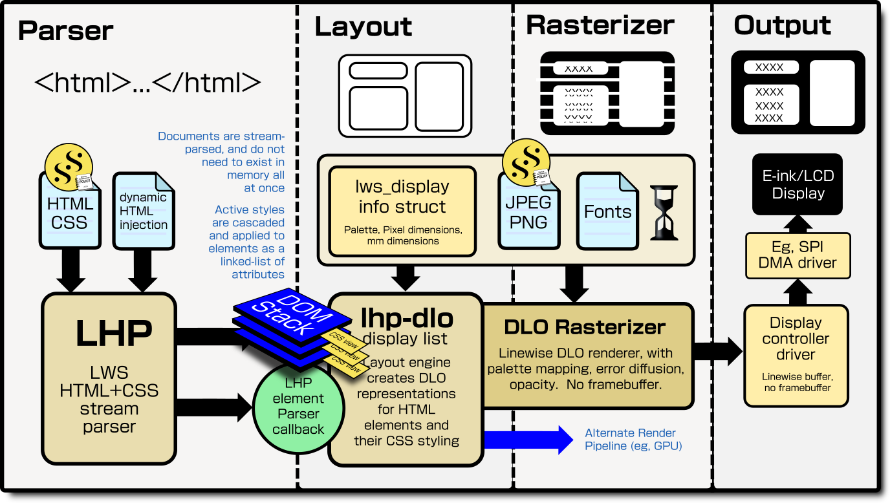
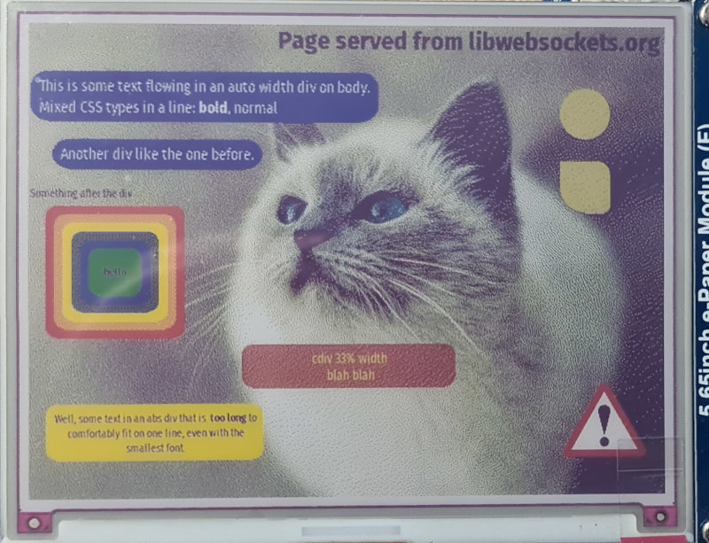
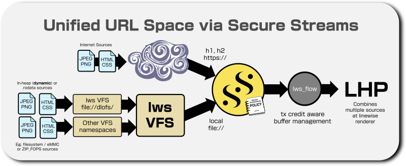
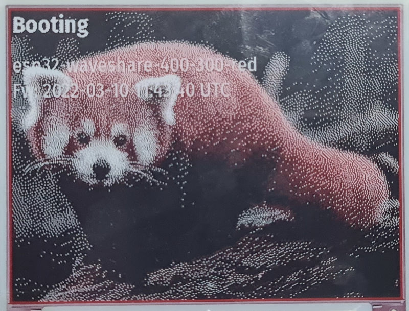
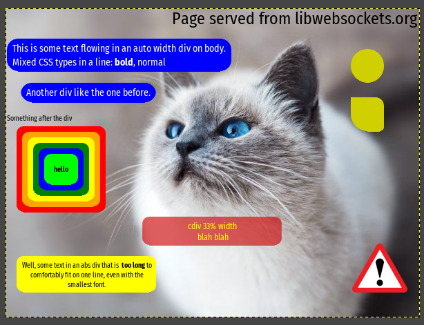
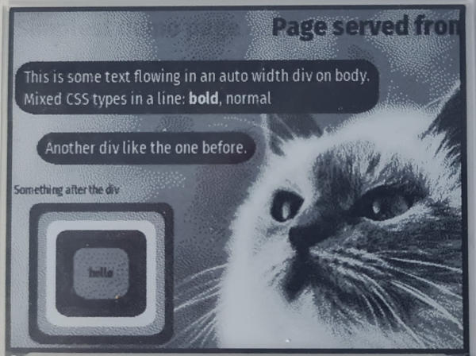
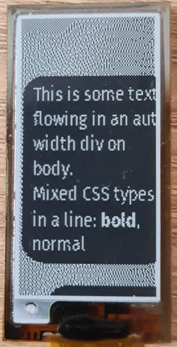

# lws LHP HTML5 and CSS parser and render pipeline

## Please note this is working end-end, but some parts incomplete and generally pre-alpha... looking for interested parties to help


<figcaption>*LHP Stream-parses HTML and CSS into a DOM and then into DLOs (lws Display List Objects).  Multiple, antialiased, proportional fonts, JPEG and PNGs are supported.  A linewise rasterizer is provided well-suited to resource-constrained devices with SPI based displays.*</figcaption>


<figcaption>*Page fetched from `https://libwebsockets.org/lhp-tests/t1.html` by an ESP32, and rendered by lws on a 600x448 ACEP 7-colour EPD with 24-bit composition.  The warning symbol at the bottom right is a .png img in an absolutely positioned `<div>`.  The yellow shapes at the top right are divs with css-styled rounded corners.  The red div is partly transparent.  Display only has a 7 colour palette.  Server only sends CSS/HTML/JPEG/PNG, all parsing and rendering done on the ESP32.*</figcaption>

## Overview

Lws is able to parse **and render** a subset of CSS + HTML5 on very constrained
devices such as ESP32, which have a total of 200KB heap available after boot at
best.  There are some technology advances in lws that allow much greater
capability that has previously been possible on those platforms.

The goal is that all system display content is expressed in HTML/CSS by user
code, which may also be dynamically generated, with CSS responsive layout
simplifying managing the same UI over different display dimensions.

There are restrictions - most generic html on the internet are too complex or
want more assets from different hosts than tiny devices can connect to - but
they are quite far beyond what you would expect from a 200KB heap limit.  It
is very possible to mix remote and local http content over h2 including large
JPEG and PNG images and express all UI in html/css.

### Features

 - Parses common HTML and CSS, somewhat beyond html5 and CSS2.1 (supports
   some CSS3)
 - Uses Secure Streams to bring in HTML, and references to JPEG and PNG ``,
   toplevel async renderer api takes an lws VFS file:// or https:// URL
   retrieved via SS.  There's easy, customizable lws VFS support at SS for
   transparently referencing dynamically-generated or .text, or SD card-stored
   HTML, or other assets
 - No framebuffer... rendered strictly linewise.  RGB framebuffer for 600x448
   image above would be 800KB, lws can render it efficiently on an ESP32 with
   only the default 200KB memory available.
 - Image data is fetched from local or remote as needed during composition,
   image buffering just 2 lines (PNG) or 8 or 16 lines (JPEG) plus decompressor
   overhead (see below for more details)
 - Layout supports DIVs, text wrapping, margin and padding, font colour,
   selection and weight supported via CSS; implementation still early on others
 - HTML element ID names that the user code cares about can be given, these are
   found during parse and layout information for the elements kept
 - Rendering is very flexible and lightweight, supports Y (8-) or RGB (24-) bit
   line buffer and composition, alpha composing, Gamma correction, RGB565 and
   individual palette RGB/Y packing, Dynamic Floyd-Steinberg error diffusion so
   the same render can look as good as possible even on B&W display
 - EPD Gray levels and spot colour palette (eg, BW-Red) supported
 - Compatible with LCD/OLED but understands needs of EPD, display management is
   all done via the event loop without any blocking waits.
 - LHP, DLO and lws_display use fixed-point int32:8 sig digits, FPU not needed
 - SPI DMA supported crossplatform, ESP32 driver provided
 - lws_display drivers provided for several common SPI display chips, most
   support ping-pong buffering so DMA proceeds while next line rendered
 - 9 specific display + ESP32 example combinations provided
 - HTML Parse -> 320x240 565 SPI Display update complete possible in under 250ms
   on ESP32 WROVER KIT, remote assets slow it down

### Restrictions

 - Only quite basic HTML + CSS implemented atm, old `style=` element attributes
   not supported.
 - Requires correct HTML, not yet tolerant of missing end tags etc
 - CSS must be inline in the HTML atm
 - lws understands ETAGs but there's no support to cache assets yet, they are
   fetched anew in realtime each time
 - There is no JS support.  Information can be collected from laid-out elements
   though by passing a list of IDs to the html parser api at the start.
 - There's no CSS Rotation, animation etc
 - There's no image scaling, images are presented 1:1
 - There is a DOM representation, but for optimal memory usage it is stream-
   parsed and destroyed element by element after using it to produce the DLO
   layout, so only DOM parent elements that are still open exist at any one time.
   This allows the parser to scale to complex html where most of it will be
   discarded.
 - CSS is parsed and kept for the whole HTML parse, since it doesn't know which
   pieces will be needed until it has parsed the html.  So giant CSS alone will
   overflow available memory on constrained targets

Heap Costs during active decode (while rendering line that includes image)

|Feature|Decoder Cost in heap (600px width)|
|---|---|
|JPEG-Grayscale|6.5KB|
|JPEG-YUV 4:4:4|16.4KB|
|JPEG-YUV 4:4:2v|16.4KB|
|JPEG-YUV 4:4:2h|31KB|
|JPEG-YUV 4:4:0|31KB|
|PNG|36KB|

Connecting to an external tls source costs around 50KB.  So for very constrained
targets like ESP32, the only practical way is a single h2 connection that
provides the assets as streams multiplexed inside a single tls tunnel.

### JIT_TRUST

Integrates CA trust bundle dynamic querying into lws, with openssl and mbedtls.
It can support all the typical Mozilla 130+ trusted CAs, using the trust chain
information from the server cert to identify the CA cert required, and just
instantiating that one to validate the server cert, if it trusts it.  The
trust CTX is kept around in heap for a little while for the case there are
multiple connections needing it.

No heap is needed for trusted certs that are not actively required.  This means
lws can securely connect over tls to arbitrary servers like a browser would
without using up all the memory; without this it's not possible to support
arbitrary connections securely within the memory constraints.

### Display List Objects (DLO)

Lws supports a logical Display List for graphical primitives common in HTML +
CSS, including compressed antialiased fonts, JPEG, PNG and rounded rectangles.

This intermediate representation allows display surface layout without having
all the details to hand, and provides flexibility for how to render the logical
representation of the layout.

### Linewise rendering

There may not be enough heap to hold a framebuffer for even a midrange display
device, eg an RGB buffer for the 600 x 448 display at the top of the page is
800KB.  Even if there is, for display devices that hold a framebuffer on the
display, eg, SPI TFT, OLED, or Electrophoretic displays, the display data is
anyway sent linewise (perhaps in two planes, but still linewise) to the display.

In this case, there is no need for a framebuffer at the device, if the software
stack is rewritten to stream-parse all the page elements asynchronously, and
each time enough is buffered, processed and composed to produce the next line's
worth of pixels.  Only one or two lines' worth of buffer is required then.

This is the lws approach, rewrite the asset decoders to operate completely
statefully so they can collaborate to provide just the next line's data Just-in-
Time.

### PNG and JPEG stream parsers

Lws includes fully stream-parsed decoders, which can run dry for input or output
at any state safely, and pick up where they left off when more data or space is
next available.

These were rewritten from UPNG and Picojpeg to be wholly stateful.  These DLO
are bound to flow-controlled SS so the content can be provided to the composer
Just In Time.  The rewrite requires that it can exit the decode at any byte
boundary, due to running out of input, or needing to flush output, and resume
with the same state, this is a complete inversion of the original program flow
where it only returns when it has rendered the whole image into a fullsize
buffer and decode state is spread around stack or filescope variables.

PNG transparency is supported via its A channel and composed by modulating
alpha.

### Compressed, Anti-aliased fonts

Based on mcufont, these are 4-bit antialised fonts produced from arbitrary TTFs.
They are compressed, a set of a dozen different font sizes from 10px thru 32px
and bold sizes only costs 100KB storage.  The user can choose their own fonts
and sizes, the encoder is included in lws.

The mcufont decompressor was rewritten to be again completely stateful, glyphs
present on the current line are statefully decoded to produce that line's-worth
of output only and paused until the next line.  Only glyphs that appear on the
current line have instantiated decoders.

The anti-alias information is composed into the line buffer as alpha.

### Integration of PNG, JPEG and file:// VFS sources into Secure Streams

Secure Streams and lws VFS now work together via `file://` URLs, a SS can be
directed to a local VFS resource the same way as to an `https://` resource.
Resources from https:// and file:// can refer to each other in CSS or ``
cleanly.


<figcaption>*All local and remote resources are fetched using Secure Streams with
a VFS `file://` or `https://` URL.  Delivery of enough data to render the next
line from multiple sources without excess buffering is handled by `lws_flow`.*</figcaption>

Dynamic content, such as dynamic HTML, can be registered in a DLO VFS filesystem
and referenced via SS either as the toplevel html document or by URLs inside the
HTML.

`.jpg` and `.png` resources can be used in the html and are fetched using their
own SS, if coming from the same server over h2, these have very modest extra
memory needs since they are sharing the existing h2 connection and tls.

### H2 tx credit buffer management

All of the efforts to make JPEG or PNG stream-parsed are not useful if either
there is an h1 connection requiring a new TLS session that exhausts the heap,
or even if multiplexed into the same h2 session, the whole JPEG or PNG is
dumped too quickly into the device which cannot buffer it.

On constrained devices, the only mix that allows multiple streaming assets that
are decoded as they come, is an h2 server with streaming modulated by h2 tx
credit.  The demos stream css, html, JPEG and CSS from libwebsockets.org over h2.
In lws, `lws_flow` provides the link between maximum buffering targets and the
tx_credit flow control management.

The number of assets that can be handled simultaneously on an HTML page is
restricted by the irreducible heap cost of decoding them, about 36KB + an RGB
line buffer for PNGs, and an either 8 (YUV4:4:4) or 16 RGB (4:4:2 or 4:4:0)
line buffer for JPEG.

However, PNG and JPEG decode occurs lazily starting at the render line where the
object starts becoming visible, and all DLO objects are destroyed after the last
line where they are visible.  The SS responsible for fetching and regulating the
bufferspace needed is started at layout-time, and the parser is started too up
to the point that the header with the image dimensions is decoded, but not
beyond that where the large decoder allocation is required.

It means only images that appear on the same line have decoders that are
instantiated in memory at the same time; images that don't share any horizontal
common lines do not exist in heap simultaneously; basically multiple vertically
stacked images cost little more than one.

The demo shows that even on ESP32, the images are cheap enough to allow a full
size background JPEG with a partially-transparent PNG composed over it.

### lws_display Composition, palette and dithering

Internally, lws provides either a 8-bit Y (grayscale) or 32-bit RGBA (trucolor)
composition pipeline for all display elements, based on if the display device is
monochrome or not.  Alpha (opacity) is supported.  This is true regardless of
final the bit depth of the display device, so even B&W devices can approximate
the same output.

Gamma of 2.2 is also applied before palettization, then floyd-steinberg
dithering, all with just a line buffer and no framebuffer needed at the device.
The assets like JPEG can be normal, RGB ones, and the rendering adapts down to
the display palette and capabilities dynamically.

The `lws_display` support in lws has been extended to a variety of common EPD
controllers such as UC8171, supporting B&W, B&W plus a third colour (red or
yellow typically) and 4-level Gray.  The ILI9341 driver for the displays found
on WROVER KIT and the ESP32S Kaluga KIT has been enhanced to work with the new
display pipline using native 565.


<figcaption>*HTML rendered on the device from file:// VFS-stored normal RGB JPEG and HTML/CSS, by ESP32 with BW-Red palette 400x300 EPD*</figcaption>


<figcaption>*Test html rendered to 24-bit RGB data directly*</figcaption>


<figcaption>*Test html rendered to 300x240 4-gray palette EPD (from RGB JPEG also fetched from server during render) using Y-only composition... notice effectiveness of error diffusion use of the palette*</figcaption>


<figcaption>*Test html rendered to 104 x 212 BW-Red palette EPD, red h1 text set by CSS `color:#f00`, on a lilygo ESP32-based EPD label board*</figcaption>


<figcaption>*Test html rendered to 104 x 212 BW flexible EPD, notice font legibility, effectiveness of dither and presence of line breaks*</figcaption>


<figcaption>*ESP32 WROVER KIT running the example carousel on a 320x200 565 RGB SPI display.  10s delay between tests snipped for brevity, otherwise shown realtime.  Moire is artifact of camera.  As composition is linewise, the JPEG and other data from libwebsockets.org is arriving and being completely parsed / composed in the time taken to update the display.  Interleaved SPI DMA used to send line to display while rendering the next.*</figcaption>

## Implications of stream-parsing HTML

To maximize the scalability, HTML is parsed into an element stack, consisting
of a set of nested parent-child elements.  As an element goes out of scope and
the parsing moves on to the next, its parents also go out of scope and are
destroyed... new parsents are kept in the stack again only while they have
children in scope.  This keeps a strict pressure against large instantaneous
heap allocations for HTML parsing, but it has some implications.

This "goldfish memory" "keyhole parsing" scheme by itself is inadequate when the
dimensions of future elements will affect the dimensions of the current one, eg,
a table where we don't find out until later how many rows it has, and so how
high it is.  There's also a class of retrospective dimension acquisition, eg,
where a JPEG `img` is in a table, but we don't find out its dimensions until we
parse its header much later, long after the whole http parser stack related to
it has been destroyed, and possibly many other things laid out after it.


## Top level API

```
int
lws_lhp_ss_browse(struct lws_context *cx, lws_display_render_state_t *rs,
		  const char *url, sul_cb_t render);
```

You basically give it an `https://` or `file://` URL, a structure for the
render state, and a callback for when the DLOs have been created and lines of
pixels are being emitted.  The source fetching, parsing, layout, and finally
rendering proceed asynchronously on the event loop without blocking beyond the
time taken to emit by default 4 lines.

In these examples, the renderer callback passes the lines of pixels to the
`lws_display` blit op.

See `./include/libwebsockets/lws-html.h` for more information.

Also see `./minimal-examples-lowlevel/api-tests/api-test-lhp-dlo/main.c`
example, you can render to 24-bit RGB on stdout by giving it a URL, eg

```
 $ ./bin/lws-api-test-lhp-dlo https://libwebsockets.org/lhp-tests/t1.html >/tmp/a.data
```

The raw RGB can be opened in GIMP.
