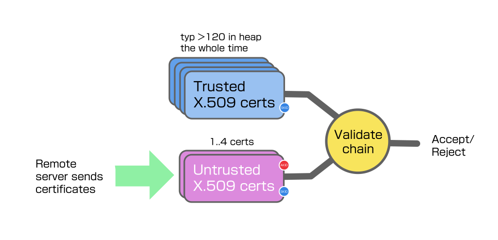
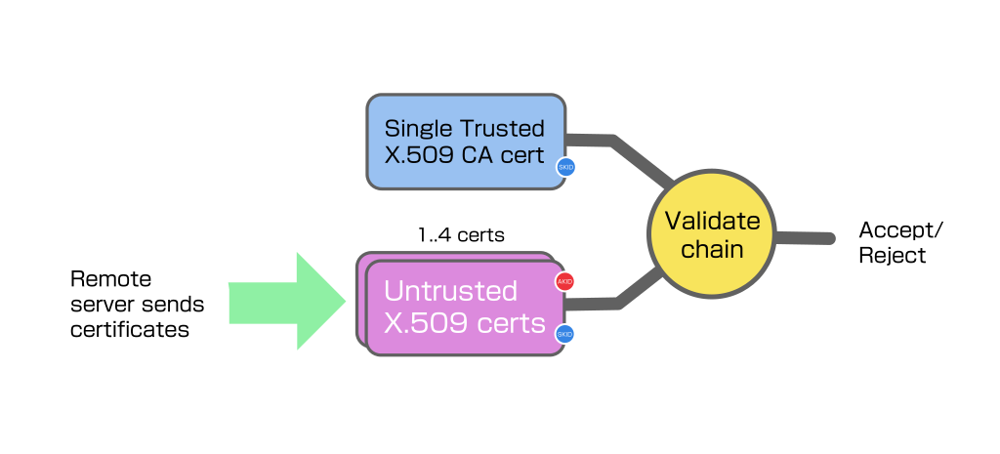
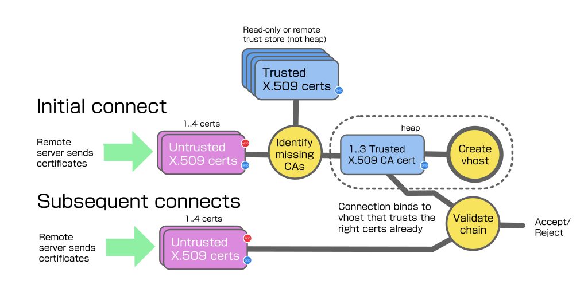
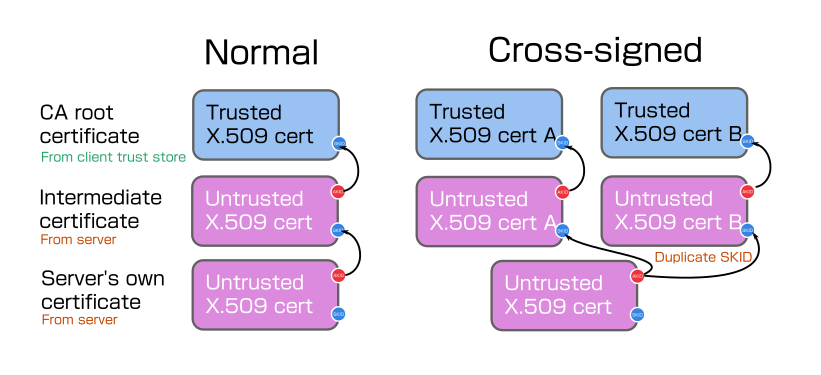

# JIT trust


## Background

Most systems using openssl rely on a system trust bundle that openssl was
compiled to load at library init.  This is a bit expensive, since it
instantiates over 120 CA X.509 certs, but most modern Linux systems don't really
notice the permanent use of 1MB or so of heap from init, the advantage is client
connections have all the trusted root certs available in memory to perform
validation.



For the kind of systems that choose mbedtls, they will typically either be
burdened by or not even have enough ram to take this approach.

If the device only connects to endpoints that are signed by a specific
CA, you can just prepare the connection with the known trusted CA, that's
the approach the examples take.  This method should still be used for critical
connections to the cloud, for example provide the necessary CA cert in the
Secure Streams policy, or at vhost creation time.



However if you also have a browser type application that could connect anywhere,
but you don't have heap spare to preload all the CAs, you need something like
"JIT trust".

## JIT trust overview

The basic approach is to connect to the server to retrieve its certificates,
then study the certificates to determine the identity of the missing trusted
cert we should be trying to validate with.



We attempt to get the trusted cert from some local or remote store, and retry
the connection having instantiated the missing CA cert as trusted for that
connection, if it is one that we do actually trust.  If it lies about what CA it
needs to validate, or we do not trust the one it asks for, subsequent
connections will fail.

If it asked for a trusted CA that we trust, and the relationship was valid, the
tls negotiation should then complete successfully, and we can cache the CA cert
and the host -> CA cert pre-trust requirement so future connections can work
first time.

## Subject Key Id and Authority Key Id

All of the certificates publish a unique-enough personal "Subject Key ID" or
SKID blob.  These are typically 20-byte hashes based on the cert public key.

When a server certificate is issued by the CA, an entry is made first in the
certificate noting the SKID of the certificate that will be used to sign it,
in an "Authority Key ID", or AKID, extension.  The certificate is then signed by
the parent certificate private key to prove it was issued by the real owner of
the CA or intermediate certificate.



Basically this AKID on a certificate is guiding the validator with
information about which certificate it claims is next in the chain of trust
leading back to a trusted CA.  Lying about it doesn't help an attacker,
because we're only using the AKID to get the CA certificate and then try to do
the full signature check using it, if it's not really signed by the AKID cert it
told, or anything else wrong, the actual validation will just fail.

A chain that terminates in a CA certificate is complete, and can undergo full
validation using the tls library.

## Converting the Mozilla trust bundle for JIT trust

Lws provides a bash script `./scripts/mozilla-trust-gen.sh` that can fetch the
latest Mozilla CA trust bundle for certs usable for tls validation, and convert
it to three different forms to allow maintaining the trust bundle in different
ways for different kinds of device to consume.

 - as a webroot directory, so you can server trusted DERs, with
   symlink indexes to the CA certs by SKID and issuer/serial

 - as an atomic binary blob, currently about 143KB, with structure
   at the start pointing to DER certs and indexes inside

 - a C-compiler friendly `uint8_t` array version of the blob,
   so it can be compiled into .rodata directly if necessary.

Currently there are 128 certs in the trust bundle, and the whole blob is about
143KB uncompressed.

## Considerations about maintaining the trust blob

Mozilla update their trust bundle at intervals, and there have been at least
three cases where they have removed or distrusted CAs from it by their own
decision, because they have issued dangerous certificates, (like one for `*`
that will validate anything at all).  Certifacte owners may also revoke their
own certificates for any reason and issue replacements.

The certs in the trust bundle expire, currently 10/128 will expire within 3
years and 50/128 over the next 10 years.  So new and replacement certificates
are also being added at intervals.

Part of using the trust bundle is building in some way to update what is trusted
over the lifetime of the device, which may exceed 10 years.

Depending on the device, it may not be any problem to keep the trust blob in the
firmware, and update the firmware ongoing every few months.  So you could build
it into the firmware using the C array include file (the minimal example takes
this approach).

Another device may have difficulty updating the firmware outside of emergencies,
it could keep the trust blob in a separate area and update it separately.
Having it as a single blob makes it easy to fetch and update.

Finally constrained devices, say in ESP32 class, may not have space or desire
to store the trust blob in the device at all, it could query a remote server on
demand to check for any trusted CA matching a given AKID and retrieve and cache
it in volatile ram.  This would use the webroot produced by the script, via tls
and a fixed CA cert outside this system.

## Format of the JIT trust blob

The trust blob layout is currently

```
00:  54 42 4c 42     Magic "TBLB"
04:  00 01           MSB-first trust blob layout version
06:  XX XX           MSB-first count of certificates
08:  XX XX XX XX     MSB-first trust blob generation unix time
0c:  XX XX XX XX     MSB-first offset from blob start of cert length table
10:  XX XX XX XX     MSB-first offset from blob start of SKID length table
14:  XX XX XX XX     MSB-first offset from blob start of SKID table
18:  XX XX XX XX     MSB-first total blob length

1c:  XX .. XX        DER certs (start at +0x1c)
  :  XX .. XX        DER cert length table (MSB-first 16-bit per cert)
  :  XX .. XX        SKID length table (8-bit per cert)
  :  XX .. XX        SKID table (variable per cert)
```

## Enabling JIT Trust

```
$ cmake .. -DLWS_WITH_TLS_JIT_TRUST=1
```

## Minimal example for JIT Trust

`minimal-examples/http-client/minimal-http-client-jit-trust` is built if JIT
Trust is enabled at cmake and `-DLWS_WITH_MINIMAL_EXAMPLES=1`.  This is based on
minimal-http-client, except the loading of the system trust bundle is defeated,
so by default it does not trust anything and cannot complete any tls connection.
It includes the mozilla trust blob as a header file when built.

It tries to do an http client connection twice, the first time fails but JIT
Trust determines which trusted CA cert is missing, retreives it from the trust
blob and creates the necessary temporary vhost with the correct CA cert(s)
trusted.  On the next retry, the connection succeeds.

## Processing of x509 AKID and SKIDs

We study each x509 cert sent by the server in turn.  We parse out the SKID and
AKID on each one and stash them (up to 4 deep).

After the initial validation fails due to lack of any trusted CA, lws has
collected all the AKID and SKIDs that were in certs sent by the server.  Since
these may be sent in any order, may be malicious, and may even contain the
(untrusted) root CA, they are sorted into a trust path using the AKID and SKID
relationships.

To cover cross-signing and cases where the root cert(s) were wrongly sent by
a misconfigured server, all of the AKIDs in the stash are queried against the
trusted CA store.  In cross-signing, multiple intermediates are provided with
the same SKID, that all match the server certificate AKID parent.  Since we
might meet certificates that trust multiple valid CAs that can validate the
certificate, we support up to three CA certs imported.

A user `lws_system_ops` handler performs the query, so it can consist of any
kind of backing store or remote lookup. Helpers are provided to query the JIT
trust mozilla blob, so the system helper is small in the typical case, just
calling lws helpers.

The results (up to three CA certs to account for cross-signing scenarios) are
collected and a 1hr TTL cache entry made for the hostname and the SKIDs of the
matched CAs, if there is no existing JIT vhost with its tls context configured
with the needed trusted CAs, one is created.

When the connection is retried, lws checks the cache for the hostname having
a binding to an existing JIT vhost, if that exists the connection proceeds
bound to that.  If there is a cache entry but no JIT vhost, one is created using
the information in the cache entry.

## Efficiency considerations

From cold, the JIT Trust flow is 

1. A sacrificial connection is made to get the server certs
2. Query the JIT Trust database for AKIDs mentioned in the certs (this may be
done asynchronously)
3. Create a temporary vhost with the appropriate trusted certs enabled in it,
   and add an entry in the cache for this hostname to the SKIDs of the CAs
   enabled on this temporary vhost
4. Retry, querying the cache to bind the connection to the right temporary vhost

An lws_cache in heap is maintained so step 1 can be skipped while hostname->
SKID items exist in the cache.  If the items expire or are evicted, it just
means we have to do step 1 again.

For a short time, the vhost created in step 3 is allowed to exist when idle, ie
when no connections are actively using it.  In the case the vhost exists and
the cache entry exists for the hostname, the connection can proceed successfully
right away without steps 1 through 3.

## APIs related to JIT Trust 

Systems that support JIT trust define an `lws_system_ops` callback
that does whatever the system needs to do for attempting to acquire
a trusted cert with a specified SKID or issuer/serial.

```
int (*jit_trust_query)(struct lws_context *cx, const uint8_t *skid, size_t skid_len, void *got_opaque);
```

The ops handler doesn't have to find the trusted cert immediately before
returning, it is OK starting the process and later if successful calling a
helper `lws_tls_jit_trust_got_cert_cb()` with the `got_opaque` from the query.
This will cache the CA cert so it's available at the next connection retry for
preloading.

An helper suitable for `ops->jit_trust_query` using trust blob lookup in .rodata
is provided in `lws_tls_jit_trust_blob_queury_skid()`, the callback above should
be called with its results as shown in the minimal example.

## Runtime tuning for JIT Trust

The context creation info struct has a couple of runtime-tunable settings
related to JIT Trust.

`.jitt_cache_max_footprint`: default 0 means no limit, otherwise the hostname->
SKID cache is kept below this many bytes in heap, by evicting LRU entries.

`.vh_idle_grace_ms`: default 0 means 5000ms, otherwise sets the length of time
a JIT Trust vhost is allowed to exist when it has no connections using it.
Notice that, eg, h2 connections have their own grace period when they become
idle, to optimize reuse, this period does not start until any h2 network
connection bound to the vhost has really closed.

## Considerations around http redirects

HTTP redirects are transactions that tell the client to go somewhere else to
continue, typically a 301 response with a Location: header explaining where to
go.

JIT Trust supports redirects to hosts with the same or different trust
requirements, each step in the redirect is treated as a new connection that will
fail, try to create a vhost with the right trust and work on the retry.

Lws rejects by default protocol downgrades (https -> http) on redirects, the
example used a context option `LCCSCF_ACCEPT_TLS_DOWNGRADE_REDIRECTS` to
override this.

## Works out of the box on recent mbedtls and openssl

No modifications are needed to either tls library.

## Compatibility Testing

A list of the top 100 sites each from the US and the ROW were combined to
produce 156 unqiue domain names [1]

The Mbedtls build of JIT trust minimal example was run against each of these
doing a GET on path `/` and restricted to h1 (`--server xxx --h1`).  In some
cases, the server at the base domain name is broken or down, as verified using
ssllabs.com as a second opinion.  These domains only resolve properly using
`www.` prefix.

In some cases the sites check the user agent and return a 4xx, these are taken
as success for this test, since there was no problem at the tls layer.

|site|h1|h2|comment|
|---|---|---|---|
|adobe.com|✓|✓||
|allegro.pl|✓|✓||
|allrecipes.com|✓|✓||
|amazon.co.jp|✓|✓||
|amazon.com|✓|✓||
|amazon.co.uk|✓|✓||
|amazon.de|✓|✓||
|amazon.fr|✓|✓||
|amazon.in|✓|✓||
|amazon.it|✓|✓||
|aol.com|✓|✓||
|apartments.com|✓|✓||
|apple.com|✓|✓||
|ar.wikipedia.org|✓|✓||
|att.com|✓|✓||
|bankofamerica.com|✓|✓||
|bbc.com|✓|✓||
|bbc.co.uk|✓|✓||
|bestbuy.com|✕|✓|redirect-> `www.` then h1: timeout, h2: 403 forbidden... geolocated?|
|booking.com|✓|✓||
|britannica.com|✓|✓||
|bulbagarden.net|✓|✓||
|businessinsider.com|✓|✓||
|ca.gov|✓|✓||
|caixa.gov.br|✕|✕|TLS trust works fine.  Continuously redirects to self... sends set-cookie that we don't return yet|
|capitalone.com|✓|✓||
|cbssports.com|✓|✓||
|cdc.gov|✓|✓||
|chase.com|✓|✓||
|chrome.google.com|✓|✓||
|cnbc.com|✓|✓||
|cnet.com|✓|✓||
|cnn.com|✓|✓||
|cookpad.com|✓|✓||
|costco.com|✕|✓|TLS trust works fine.  But with or without `www.` server does not reply within 15s on h1, sends 403 OK on h2... Curl acts the same as we do, firefox works... geolocated?||
|craigslist.org|✓|✓||
|dailymotion.com|✓|✓||
|de.wikipedia.org|✓|✓||
|dictionary.com|✓|✓||
|ebay.com|✓|✓||
|ebay.co.uk|✓|✓||
|en.wikipedia.org|✓|✓||
|epicgames.com|✓|✓||
|espn.com|✓|✓||
|es.wikipedia.org|✓|✓||
|etsy.com|✓|✓||
|expedia.com|✓|✓||
|facebook.com|✓|✓||
|fandom.com|✓|✓||
|fedex.com|✓|✓||
|finance.yahoo.com|✓|✓||
|www.foodnetwork.com|✓|✓|`www.` served correctly, base domain is misconfigured with expired cert, confirmed with ssllabs + curl|
|forbes.com|✓|✓||
|foxnews.com|✓|✓||
|fr.wikipedia.org|✓|✓||
|gamepedia.com|✓|✓||
|genius.com|✓|✓||
|glassdoor.com|✓|✓||
|globo.com|✓|✓||
|google.com|✓|✓||
|healthline.com|✓|✓||
|homedepot.com|✓|✓||
|hulu.com|✓|✓||
|hurriyet.com.tr|✓|✓||
|id.wikipedia.org|✓|✓||
|ign.com|✓|✓||
|ikea.com|✓|✓|`www.` served correctly, base domain is misconfigured with nonresponsive server, confirmed with ssllabs|
|ilovepdf.com|✓|✓||
|imdb.com|✓|✓||
|indeed.com|✓|✓||
|indiatimes.com|✓|✓||
|instagram.com|✓|✓||
|investopedia.com|✓|✓||
|irs.gov|✓|✓||
|it.wikipedia.org|✓|✓||
|ivi.ru|✓|✓||
|ja.wikipedia.org|✓|✓||
|kakaku.com|✓|✓||
|khanacademy.org|✓|✓||
|kinopoisk.ru|✓|✓||
|leboncoin.fr|✓|✓||
|linkedin.com|✓|✓||
|live.com|✓|✓||
|lowes.com|✓|✓||
|macys.com|✕|✓|TLS trust works fine.  Continuously redirects to self... `www.` same, curl acts same but OK if given -b -c, so akami cookie storage issue|
|mail.ru|✓|✓||
|mail.yahoo.com|✓|✓||
|mapquest.com|✓|✓||
|mayoclinic.org|✓|✓||
|medicalnewstoday.com|✓|✓||
|mercadolivre.com.br|✓|✓||
|merriam-webster.com|✓|✓||
|microsoft.com|✓|✓||
|msn.com|✓|✓||
|namu.wiki|✓|✓||
|nbcnews.com|✓|✓||
|netflix.com|✓|✓||
|nih.gov|✓|✓||
|nl.wikipedia.org|✓|✓||
|ny.gov|✓|✓||
|nytimes.com|✓|✓||
|ok.ru|✓|✓||
|onet.pl|✓||
|orange.fr|✓|✓||
|paypal.com|✓|✓||
|pinterest.com|✓|✓||
|pixiv.net|✓|✓||
|play.google.com|✓|✓||
|pl.wikipedia.org|✓|✓||
|www.programme-tv.net|✓|✓|OK with `www.`, without `www.` TLS trust works fine but server does not reply, same with curl|
|pt.wikipedia.org|✓|✓||
|quizlet.com|✓|✓||
|quora.com|✓|✓|||
|rakuten.co.jp|✓|✓||
|realtor.com|✓|✓||
|reddit.com|✓|✓||
|reverso.net|✓|✓||
|roblox.com|✓|✓||
|rottentomatoes.com|✓|✓||
|ru.wikipedia.org|✓|✓||
|sahibinden.com|✓|✓||
|smallpdf.com|✓|✓||
|speedtest.net|✓|✓||
|spotify.com|✓|✓||
|steampowered.com|✓|✓||
|target.com|✓|✓||
|theguardian.com|✓|✓||
|tripadvisor.com|✓|✓||
|tr.wikipedia.org|✓|✓||
|twitch.tv|✓|✓||
|twitter.com|✓|✓||
|uol.com.br|✓|✓||
|ups.com|✓|✓||
|urbandictionary.com|✓|✓||
|usatoday.com|✓|✓||
|usnews.com|✕|✓|TLS trust works fine. Needs `www.` else server doesn't respond in 15s, sends 403 on h2, Curl acts the same, geolocated?|
|usps.com|✓|✓||
|verizon.com|✓|✓||
|vk.com|✓|✓||
|walmart.com|✓|✓||
|washingtonpost.com|✓|✓||
|weather.com|✓|✓||
|webmd.com|✓|✓||
|whatsapp.com|✓|✓||
|wowhead.com|✓|✓||
|wp.pl|✓|✓||
|www.gov.uk|✓|✓||
|xfinity.com|✓|✓||
|yahoo.co.jp|✓|✓||
|yahoo.com|✓|✓||
|yandex.ru|✓|✓||
|yellowpages.com|✓|✓||
|yelp.com|✓|✓||
|youtube.com|✓|✓||
|zh.wikipedia.org|✓|✓||
|zillow.com|✓|✓||

[1]
```
wget -O- https://ahrefs.com/blog/most-visited-websites/ | grep most-visited-websites-us | \
        sed -E 's/class="column-2">/|/g' | tr '|' '\n' | \
        sed 's/<.*//g' | grep -v Domain | grep -v Josh | sort | uniq
```

