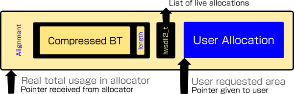

# lws_backtrace and lws_alloc_metadata

|Area|Definition|
|---|---|
|Cmake|`LWS_WITH_COMPRESSED_BACKTRACES` on by default|
|API|`./include/libwebsockets/lws-backtrace.h`|
|README|./READMEs/README.lws_backtrace.md|

## lws_backtrace

The `lws_backtrace` apis provide a way to collect backtrace addresses into a
struct, and an efficient domain-specific compressor to reduce the number of
bytes needed to express the backtrace stack.

This information is particularly useful in RTOS type systems to understand heap
usage.  The information would typically be sent off the embedded device, in logs
or it into own stream, and decompressed and processed off the embedded device,
converted to source information via addr2line or similar.

It only works with gcc and probably clang at the moment (patches welcome).

## lws_alloc_metadata apis

This provides helpers on top of `lws_backtrace` that are suitable for adapting
your heap allocator to create compressed metadata such as the call stack at
allocation time

 - optionally report allocation and free events with this information
   synchronously to a user supplied callback

 - optionally conceal the additional metadata behind allocations transparently

The extra metadata contains information on allocation size, and the backtrace of
the code path that originally performed the allocation.  Live allocations are
also listed on one or more lws_dll2_owner_t that can be walked to dump active
allocations along with the responsible code path.

## Tuning the call stack

Entries at both ends of the call stack may be invariant and therefore just
bloat to store.  At the top end of the call stack, the backtrace will show the
path through lws_backtrace apis and perhaps other apis.  At the bottom end,
depending on your system, the backtrace may detail call sequences from the
loader that started your application.

For those reasons, the cmake variables `LWS_COMPRESSED_BACKTRACES_SNIP_PRE`
and `LWS_COMPRESSED_BACKTRACES_SNIP_POST` (defaulting to 2 and 1 respectively)
may be set to remove invariant, uninteresting call stack information from the
top and bottom of the call stack.

## LWS_WITH_ALLOC_METADATA_LWS

An optional, off-by-default implementation is provided for the lws_*alloc()
apis, using the alloc_metadata apis to instrument all allocations via
lws_*alloc().  This is not so useful as instrumenting the system allocator with
alloc_metadata apis, since it only shows lws allocations, but it is a complete
example to show how to do it.

## Allocator instrumentation and thread-safety

Unless your application is totally singlethreaded, when instrumenting a real
allocator, care must be taken with

 - `_lws_alloc_metadata_adjust()`
 - `_lws_alloc_metadata_trim()`
 - `_lws_alloc_metadata_dump()`
 
apis which deal with the hidden overallocation and listing allocations, that
they are called from a locked critical section that disallows reentry, either
an existing one that the allocator already uses, or add a new mutex.

## Dumping entire active instrumented heap allocations

Calling `_lws_alloc_metadata_dump()` allows you to walk the current list of
allocations from a heap and dump the backtrace responsible for its allocation.
You can define your own iterator callback, or use a helper callback that is
provided, `lws_alloc_metadata_dump_stdout`, which issues the heap metadata in
the lws convention base64 format described below.

## Convention for emission of compressed backtraces

To simplify triggering dumps, a convention is defined with a 3-character
lead-in identifying lines as dumps or backtraces.  This kind of approach makes
it easy to emit the metadata into logs and fish them out with grep or similar.

|lead-in|signifies|Example|
|---|---|---|
|~m#|Compressed allocator backtrace, eg, emitted into logs|~m#IF0BmagugNDWgCnkhdAYpQa6wAAV|
|~b#|Decoded, uncompressed backtrace line suitable for `addr2line`|~b#size: 7520, 0x406651 0x406852 0x406c1b 0x406294|

Both examples are complete representations of the same 4-level, 64-bit compressed
backtrace.

## Compressed backtrace decode tool

The `lws-api-test-backtrace` example (requires `LWS_WITH_COMPRESSED_BACKTRACES`
to build) decodes the base64 representations with or without the 3-character
lead-in, to textual output suitable for `addr2line`.  Eg

```
$ echo -n "~m#IF0BmagugNDWgCnkhdAYpQa6wAAV" | lws-api-test-backtrace
~b#size: 7520, 0x406651 0x406852 0x406c1b 0x406294
```

You can use it with `addr2line` in this kind of way (you probably want to give
`-f -p` to `addr2line` as well)

```
addr2line -e myapplication `echo -n "~m#IF0BmUQugNCkgCnkhdAYpQa6wAAV" | ./bin/lws-api-test-backtrace 2>/dev/null | grep '~b#' | cut -d',' -f2-`
/projects/libwebsockets/lib/core/alloc.c:124
/projects/libwebsockets/lib/core/alloc.c:213
/projects/libwebsockets/lib/core/context.c:600
/projects/myapplication/main.c:55
```

There is a shell script `./contrib/heapmap.sh` which takes a screenscrape of
a dump's `~m#` log lines and processes them into an allocation size, backtrace,
and function names (especially in RELEASE mode, either a function name hint or
the source coordinates are available).

## lws_backtrace compression

The compressed blob has an outer structure designed for prepending, where the
information available at recovery is a pointer to the end of it.



### Outer compressed blob layout in memory

This goes behind the reported allocation, the actual allocation is increased
to allow for it and we report what the caller asked for by pointing at the end
of this.  It means eg at free() time, we are told the address just past the end
of this and work backwards to find the start of the compressed blob (which is
further aligned backwards to ptr boundary to recover the true allocation start).

|data|bits|meaning|
|---|---|---|
|compressed blob|variable, padded to byte boundary|Backtrace and extra info|
|compressed length|fixed, 16|MSB-first 16-bit byte count of compressed blob, including the 16-bit length itself|
|lws_dll2_t|fixed, 3 x pointers|linked-list for tracking|

### Bitwise structure inside the compressed blob

|data|bits|meaning|
|---|---|---|
|stack depth|5|Number of backtrace callstack levels present|
|Call stack items, one per stack depth|variable|Compressed Instruction Pointer value|
|alloc size bits|6|Number of bits in alloc size|
|alloc size literal|variable|Allocation size|

### Call stack item domain-specific compression

The goal is to compress 32- or 64-bit backtraces efficiently.

The Call stack items are compressed one of two ways and start with a bit
indicating which method was used for this Call stack item.

 - 0 = literal value, 1 = delta against a previous reference value
 
The literals issue a bit count and then the significant bits

 - a 6-bit bit count
 - the significant bits of the literal
 
The delta from a previous Call stack item looks like this:

 - a 3-bit index (from -1 to -8) says how far back from the
current stack item the reference value can be found from the call stack
 - a 1-bit sign where 0 == add the delta and 1 == subtract the delta
 - a 6-bit bit  count for the delta
 - the significant bits of the delta
 
The delta is decoded, and added or subtracted from the earlier reference result
to arrive at the correct reconstruction.
 
The first Call stack item is always a literal.

## Note for esp-idf

Backtrace generation in esp-idf requires `CONFIG_COMPILER_CXX_EXCEPTIONS` set
in sdkconfig.
