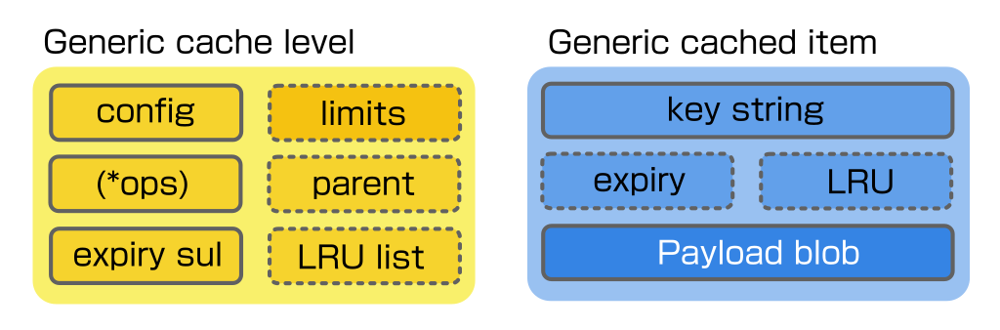
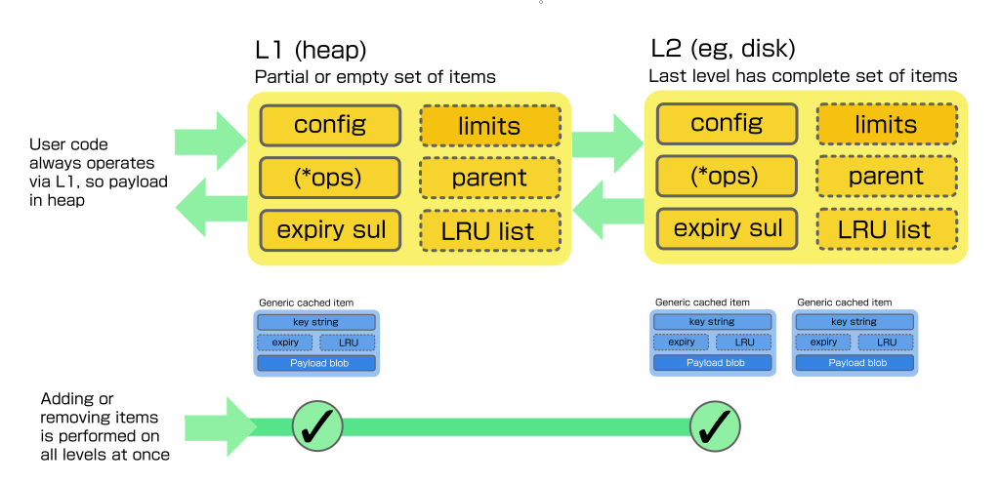

# lws_cache: Flexible single and multilevel caching

lws_cache implements a single- or multi-level cache for generic payload items
that are **keyed by a unique string**.



L1 cache is always stored on heap, but it may be hooked up to additional levels
of cache objects with different backing storage.  The last level always contains
a complete set of cached items, earlier levels may be empty or contain a partial
set of objects.

User code can define its own subclassed lws_cache objects with custom storage
formats and media, while being able to take advantage of a suitably-sized L1
heap cache to minimize the cost of repeated access.



You can find examples of how to create, use and destroy single and multilevel
caches in `minimal-examples/api-tests/api-test-lws_cache`

## Cache size restriction, LRU and TTL

The max heap footprint of its items and max number of items can be capped.  LRU
tracking is performed so the least recently relevant items are evicted first.
It's also possible to limit the maximum size of any single payload.

Time To Live (TTL) tracking is also performed automatically, so cached items
auto-expire if a non-zero TTL is provided when the object is created.  A user
callback can be defined to get called when an item is about to be removed from
a particular cache level, in case any housekeeping needed.

## Atomicity

Items in L1 can be accessed in heap casually and reliably if the following is
borne in mind:

 - Any return to the event loop may perform removal of cache items due to TTL
expiry

 - Any operation that writes new items may evict items from non-last
cache levels which have limits to the footprint or item count to make room for
it, using LRU ordering.

In short process cache results before returning to the event loop or writing
or removing items in the cache.

## Cache creation

Caches are created using an info struct `struct lws_cache_creation_info`
that should be zeroed down.  Most members are optional and can be left at zero,
a pointer to the lws_context and a short cache name are mandatory.

```
struct lws_cache_ttl_lru *
lws_cache_create(const struct lws_cache_creation_info *info);
```

How caches work is defined by an "ops struct" that the cache is bound to at
creation time.  `lws_cache_ops_heap` ops struct is provided by lws, you can
define your own to implement your own specialized cache level.  See
`./include/libwebsockets/lws-cache-ttl.h` for the definition.

## Cache destruction

Created cache levels should be destroyed when you are finished with them.

```
void
lws_cache_destroy(struct lws_cache_ttl_lru **cache);
```

For L1, in heap, this frees any allocations.  For other levels, eg, with file
storage for the items, this would close the file and leave any entries as they
are.

## Writethrough

```
int
lws_cache_write_through(struct lws_cache_ttl_lru *cache,
			const char *specific_key, const uint8_t *source,
			size_t size, lws_usec_t expiry, void **ppay);
```

The combined caches are always accessed via the L1 cache, writing new items is
done at L1 and writes through to each cache layer immediately, so new items go
into the backing store without delay, but are available from heap for read.

If existing keys are rewritten, the previous item of the same key is deleted
from all levels of the cache before writing the new one.

## Removal

Removal also is performed at all cache levels at once.

```
int
lws_cache_item_remove(struct lws_cache_ttl_lru *cache, const char *wildcard_key);
```

internally earlier cache levels can evict cached items just at their level, but
this is triggered automatically and not by api.

A wildcard key is supported, removing all items matching, eg "myitem*".

## Get by key

```
int
lws_cache_item_get(struct lws_cache_ttl_lru *cache, const char *specific_key,
		   const void **pdata, size_t *psize);
```

Apis are provided to get the blob related to a specific key, if it exists at
any cache layer.  Again this should use L1, it will bring a copy of the item
into L1 if one is not already there, so it can be accessed from heap.

## Lookup with wildcards

```
int
lws_cache_lookup(struct lws_cache_ttl_lru *cache, const char *wildcard_key,
		 const void **pdata, size_t *psize);
```

lws_cache also supports **lookup** queries that contain wildcards or otherwise match
on multiple keys according to cache-specific rules.  These queries do not return
a single item, instead they return lists of keys that match, in a blob of its
own that is also cached in L1.

The user can walk the lookup results blob using a provided helper api

```
int
lws_cache_results_walk(lws_cache_results_t *walk_ctx);
```

After recovering each result key this way, the user code can use the _get api
to access the blob for each indiviudally.

The lookup results themselves are cached in L1, any new key that matches the
wildcard lookup in any cached results, or any deletion of items with keys
matching the cached wildcard lookup invalidate the affected cached lookup
results so they will be regenerated next time.

In the typical case after a lookup, at least for a while the lookup results blob
and all items mentioned in the lookup results will already be in L1 and cheaply
accessible.

## Expunging

An api is also provided to "expunge" or completely empty all cache levels and
corresponding backing stores.

```
int
lws_cache_expunge(struct lws_cache_ttl_lru *cache);
```

