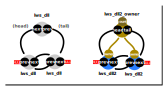

# lws_dll Doubly-linked list

## Introduction

Lws supports two kinds of doubly-linked list, `lws_dll` and `lws_dll2`.

Unless memory is at a big premium, or it has to work on lws < v3.2, it's
best to simply use `lws_dll2`.



## How to use

The basics are the same for lws_dll and lws_dll2.

The list objects point only to themselves, and you use the `lws_container_of`
macro to get a pointer to your struct that contains the list object.  Doing
it this way

 - the list object does not have to be the first thing in your struct
 
 - your struct can contain multiple list objects and appear on lists belonging
   to multiple owners simultaenously,
   
### lws_dll Minimal example

```
struct mystruct {
	....
	lws_dll list;
	...
};

lws_dll owner;
```

Adding a mystruct to the owner list (...add_tail() works the same way but adds
to the other end of the list)

```
	struct mystruct *p;
	
	...
	
	lws_dll_add_head(&p->list, &owner);
```

Removing the list object from its owner

```
	lws_dll2_remove(&p->list, &owner);
```

If you have a `struct lws_dll *d` pointing to `list` in struct mystruct, you can
convert it to a `struct mystruct *p` ike this

```
	struct mystruct *p = lws_container_of(d, struct lws_dll, list);
```

### lws_dll2 Minimal example


```
struct mystruct {
	....
	lws_dll2 list;
	...
};

lws_dll2_owner owner;
```

Adding a mystruct to the owner list (...add_tail() works the same way but adds
to the other end of the list)

```
	struct mystruct *p;
	
	...
	
	lws_dll2_add_head(&p->list, &owner);
```

Removing the list object from its owner (notice compared to lws_dll, it doesn't
need to be told the owner)

```
	lws_dll2_remove(&p->list);
```

If you have a `struct lws_dll2 *d` pointing to `list` in struct mystruct, you
can convert it to a `struct mystruct *p` ike this

```
	struct mystruct *p = lws_container_of(d, struct lws_dll2, list);
```

## Summary Comparing lws_dll and lws_dll2

 - both offer a doubly-linked list object, and (since v3.2) track both the
   head and tail in an "list owner" object
   
 - both are initalized by memsetting to 0

 - for `lws_dll`, it reuses an `lws_dll` as the "owner", for `lws_dll2`, there's a
   specific `lws_dll2_owner` structure for that
   
 - `lws_dll2_owner` also keeps count of the number of list elements
 
 - `lws_dll2` knows which owner's list it is participating on.  So it can remove
   itself and update the owner without the caller needing to know its owner.
   In the case there are several potential owners list objects may be on, this
   is very convenient.

 - `lws_dll` is simpler and has a smaller footprint (two pointers per entry vs
   three).  But you have to know the exact list owner to perform operations on
   it.
 
## apis
 
|function|lws_dll|lws_dll2|
|---|---|---|
|add entry at head|`void lws_dll_add_head(struct lws_dll *d, struct lws_dll *phead)`|`void lws_dll2_add_head(struct lws_dll2 *d, struct lws_dll2_owner *owner)`|
|add entry at tail|`void lws_dll_add_tail(struct lws_dll *d, struct lws_dll *phead);`|`void lws_dll2_add_tail(struct lws_dll2 *d, struct lws_dll2_owner *owner)`|
|remove entry from its owning list|`void lws_dll_remove_track_tail(struct lws_dll *d, struct lws_dll *phead)`|`void lws_dll2_add_tail(struct lws_dll2 *d, struct lws_dll2_owner *owner)`|
|get owner|(not supported)|`struct lws_dll2_owner * lws_dll2_owner(const struct lws_dll2 *d)`|
|check if item is detached from any list|`lws_dll_is_detached(struct lws_dll *d, struct lws_dll *phead)|int lws_dll2_is_detached(const struct lws_dll2 *d)`|
|iterate through items on list|`int lws_dll_foreach_safe(struct lws_dll *phead, void *user, int (*cb)(struct lws_dll *d, void *user))|int lws_dll2_foreach_safe(struct lws_dll2_owner *owner, void *user, int (*cb)(struct lws_dll2 *d, void *user))`|

