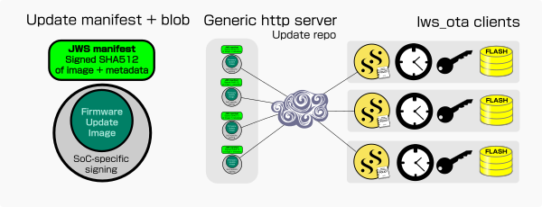

# lws_ota Over The Air updates

|Area|Definition|
|---|---|
|Cmake|`LWS_WITH_OTA` off by default|
|API|`./include/libwebsockets/lws-ota.h`|
|README|./READMEs/README.lws_ota.md|



`lws_ota` apis provide a standardized way to securely distribute gzipped
firmware update blobs over the internet, using a detached signed manifest that
describes the latest update for a particular variant and the corresponding
compressed firmware update blob.

Generic client infrastructure to fetch and check the related manifest on an
http update server to discover new firmware at boot and periodically, download
the related firemare via Secure Streams, decompress on-the-fly, validate the
manifest signature against your issuer public key, and validate the decompressed
download against the manifests's signed hash, then if valid, interact with
platform-specific firmware update procedures such as erase and flash as
implemented in user code via lws_system, asynchronously.

This gives you a way to have standardized production, identification, discovery
and security on firmware updates leveraging the lws arrangements for all the
generic work no matter the SoC involved, while still remaining compatible with
SoC-specific OTA procedures flexibly.

`lws_ota` signing is an extra layer on top ensuring that only the firmware
issuer with the approriate key can sign the update manifest for the firmware
blobs that will be accepted by the client as valid.  SoC-specific firmware
signing (eg, with bootloader key) is done separately before the `lws_ota` layer;
SoC-specific signatures should already have been applied on the blob before
`lws_ota` hashes it and signs the hash in the manifest.

## Separation of generic OTA and platform operations

lws_ota handles generic OTA steps such as checking for new firmware, starting
a new OTA action, downloading the image, checking its integrity and deciding if
it should be finalized.

For all platform-specific steps such as selection of OTA slot or the actual
flashing, there is an lws_system ops struct `lws_ota_ops_t` that lets the user
code define how the operations are actually done, outside of lws itself.
lws_ota calls these user-defined ops struct members to get platform-specific
stuff done without needing to understand the details.

These operation apis are given a completion callback and opaque completion
context pointer to call when their async operation completes; if the platform
implementation is synchronous, it's also possible to block and call the
completion callback before returning.

## Structure of firmware repo

The lws_ota network code uses "ota" streamtype from the policy, this sets the
endpoint address of the firmware repo and the first part of the URL path to use
statically, reflecting where the generic firmware update infrastructure lives.

In top of that, at build-time, cmake var `LWS_OTA_VARIANT` can be set to a
URL-compatible string identifying the build variant, this is appended to the
URL path using metadata so a given variant can only see firmware related to
its specific kind of device.

For example, the ota streamtype sets the endpoint (server address) and the first
part of the repo path, like this for lws examples

```
        "}},{\"ota\": {"
                "\"endpoint\":"         "\"libwebsockets.org\","
                "\"port\":"             "443,"
                "\"protocol\":"         "\"h2\","
                "\"http_method\":"      "\"GET\","
                "\"http_url\":"         "\"firmware/examples/${ota_variant}/${file}\","
                "\"metadata\": [{\n"
                        "\"ota_variant\":"      "\"\",\n"
                        "\"file\":"             "\"\"\n"
                "}],\n"
                ...
```

`ota_variant` metadata is set to the application's unique variant name, and
`file` metadata is set first to "manifest.jws" to find out if anything newer is
available, and if there is, to whatever filepath is told in the manifest as the
latest.

## Update discovery approach

lws_ota autonomously checks for update at boot, 30 + a random jitter of up to
15 seconds after reaching OPERATIONAL, and thereafter at intervals set in the
lws_ota_ops_t struct, by default every 24h.

To minimize network load from potentially large fleets checking for updates,
each variant has at least two files in its directory in the repo.

 - a signed detached JWS containing JSON manifest information about the latest
   update for the variant it relates to, with the fixed name "manifest.txt", an
   example looks like this

```
eyJhbGciOiJFUzUxMiJ9.ewoJInZhcmlhbnQiOgkieHl6LXYxIiwKCSJwYXRoIjoJCSJ4eXotdjEtM
jAyMi0wMi0yMi0wMS5sd3NvdGEiLAoJInNpemUiOgkJMTIzNDU2NywKCSJ1bml4dGltZSI6CTE2NDU
3NjgxMDEsCgkic2hhNTEyIjoJIjk5MjYwMzNkY2UwZDE4NmM0ZTNkMzViMDM4MjU2NTYwMzFlZTQzN
jA4NDFhNGI5ZGM2ZGY5YzdkNDZhZGRlMDM3NmJhZWQ0ODk5NDhkYjEwMmQ3ZjFmMWJkODVmYTJkNDc
zOTNhZjg0YTMzZGQyNmZlZDQ5ZDZmNDBjNTJlMGQ2IiwKCSJyZXNldCI6CXRydWUKfQoK.AKbYKDcG
cV5LwKSs9_c8T3qusD_PMrC2zCQjbNvxmcvstAE6DDs6NwP6PaaW9aLO7uQ2uZtXPC_01VRFiasteX
55AXp7-flJdWOOS-_K0BJMwbb-qO62QWDV3-7rr60JUr8IQ8FTmXjJkFOzYXG1iAVevOeo4kyCNcF2
CKsJgVnrqwFn
``` 
   
... the protected part above decodes to...
 
```json
{
	"variant":	"xyz-v1",
	"path":		"xyz-v1-2022-02-22-01.lwsota",
	"size":		1234567,
	"unixtime":	1645768101,
	"sha512":	"9926033dce0d186c4e3d35b03825656031ee4360841a4b9dc6df9c7d46adde0376baed489948db102d7f1f1bd85fa2d47393af84a33dd26fed49d6f40c52e0d6",
	"reset":	true
}
```

... this describes the valid update image including its sha512 hash and
expected size, and the filename on the server to fetch it from.

 - the matching, unmodified update image specified in the manifest, with
 whatever signatures the SoC update or boot process requires to see applied.  In
 this example the update image is at the same url but file "xyz-v1-2022-02-22-01.lwsota"
 
there is a separate signed, detached JWS manifest in each variant directory
(named `mainfest`) that describes the latest available update available in the
same server directory.

By using JSON and standardized, agile signing and validation, using currently
secure crypto like SHA512 and EC P521, the information in the JWS is easily and
safely extensible.

## Discovery of potential update vs updating

If the downloaded manifest JWS describes an update that we want, lws tries to
advance the system state to `LWS_SYSTATE_MODAL_UPDATING`.  User code can
register a notifier for system state changes that can either hook the transition
to this to indicate that the device is attempting to update, or countermand the
transition and defeat the update.  If it is not allowed to reach the required
state, the update is ignored and will be retried at the next periodic check.

## Using variant names as update epochs

In the case that updates change data stored on devices and must be applied in
some order, for example because on-device state formats have changed and must be
upgraded, updates after the change can use a different variant name (and so a
different directory path on the update repo and variant name stored in the
firmware).

Older devices can then update at any time, and will only see the older update
with the old variant name that brings their data to the new format, and has the
new variant name in itself, after rebooting into that and doing the local data
uplevel, it will have the new variant name and be able to see the latest updates
for that.

One-time updates in user code should be written to occur at
`LWS_SYSTATE_ONE_TIME_UPDATES` lws_system notification state, before
OPERATIONAL, which triggers the boot update check that might otherwise occur
first.

This method allows older devices to connect much later and still rejoin the
current updates cleanly, without needing all future updates to carry around the
code handling the data upgrade.

## Interface to platform flash operations

An ops struct for lws_ota operations is defined by lws, along with an enum for
the async operations it is requested to do

typedef enum {
	LWS_OTA_ASYNC_START = 1,
	LWS_OTA_ASYNC_WRITE,
	LWS_OTA_ASYNC_ABORT,
	LWS_OTA_ASYNC_FINALIZE
} lws_ota_async_t;

```C
typedef struct {

	/* asynchronous (completions via lws_cancel_service) */

	int (*ota_start)(struct lws_ota *g);
	/**< Creates the ota task and queues LWS_OTA_ASYNC_START on it. */

	void (*ota_queue)(struct lws_ota *g, lws_ota_async_t a);
	/**< Queue next command to OTA task (args are in g) */

	/* synchronous */

	int (*ota_report_current)(struct lws_ota *g, int bad);
	/**< Report information to the platform code about how we feel about the
	 * current boot... if we can check the OTA then we report it seems in
	 * good shape (bad = 0), if we can identify it's brain-damaged then
	 * (bad = 1).  What action the platform takes about these reports is up
	 * to the platform code */

	int (*ota_progress)(lws_ota_ret_t state, int percent);
	/**< Gets called so the platform can represent OTA progress, give
	 * platform a chance to choose what to do about an available update */
	 
	int (*ota_get_last_fw_unixtime)(uint64_t *fw_unixtime);
	/**< tries to recover the newest firmware unixtime that had been
	 * OTA'd into fw_unixtime, updates from same or earlier unixtime are
	 * ignored for update purposes. */

	int ota_periodic_check_secs;
	/**< Check after this many seconds for a new update */
} lws_ota_ops_t;
```

If the platform being built has a specified OTA methodology, for example as with
esp-idf, lws may provide platform implementations for

 - `lws_plat_ota_start()`
 - `lws_plat_ota_queue()`
 - `lws_plat_ota_report_current()`
 - `lws_plat_ota_get_last_fw_unixtime()`
 
that are suitable for use in the first four `lws_opta_ops_t` callbacks, either
directly or by being called through to by user implementations.

This means platform implementations for the flashing and OTA management part
only need to be done once per platform and can be reused easily by applications.

OTA operations on the platform are typically done in their own thread, created
at `lws_plat_ota_start()` and terminated when the `ABORT` or `FINALIZE` operations
are queued.  Such an implementation can be found for esp32 in
`./lib/plat/freertos/esp32/esp32-lws_ota.c`.

The generic lws_ota code queues async operations on the thread using the
`(*ota_queue)` op and on completion, the thread calls `lws_cancel_service()` to
synchronize the result back with the generic lws_ota code in the lws event loop
thread.  So there is a clean separation between generic OTA check, download and
validation flow, and platform-specific OTA actual flashing and slot selection
etc.

## Storing firmware state

The firmware itself contains a public `const char *lws_ota_variant`, which is
set via cmake symbol `LWS_OTA_VARIANT`.  By convention (used for the signing
and upload script) the leaf directory of the cwd is the variant string used for
the build.

This information is used as part of the url path when checking for updates, so
only updates appropriate for the currently installed build variant can be seen.

Part of the information signed in the manifest is the unixtime of the firmware
blob file, the last installed firmware is stored by the platform-specific OTA
op in whatever manner suits the platform, for esp32 it used `lws_settings` apis
to store them in an esp-idf key-value store in a SPI flash partition.

Subsequently when checking for updates, the new manifest's unixtime is compared
to the last installed update's unixtime, and ignored if older or same.

## Creation of Signing and Verification keys

The manifest needs some unique crypto keys to be signed with, and verified by.
The JWS lws uses needs Json Web Keys or JWKs.

Build lws with `-DLWS_WITH_JOSE=1`, make and make install, this creates some
`lws-crypo-*` examples for working with JOSE / JWK / JWS on your path.

Produce a new 512-bit EC JWK in both private and public-only forms like this:

```bash
$ lws-crypto-jwk -t EC --curve P-521 \
		       --kid="my.org lws_ota firmware signing key v1" \
		       --use="sig" \
		       --key-ops='sign verify' \
		       --public my-lws-ota-v1.public.jwk >my-lws-ota-v1.private.jwk
```

You should place both your public and private JWKs in your build user's home
directory `~/.lws_ota/`, so they are available but secure to your build user.

You should point cmake option `-DLWS_OTA_PUBLIC_JWK_FILE="$ENV{HOME}/.lws_ota/name-of-public.jwk"` to
the public JWK, so it can be imported into your build and made available to
lws_ota so it can validate the manifest JWS with it.

## Creating the signed manifest and uploading to the repo

Lws includes a script to process and upload your firmware image in one step,
`./contrib/lws_ota-manifest.sh`.

The script takes the variant name from the last part of the cwd it is executed
from.

The script takes three arguments, the firmware image, the path to the private
JWK for signing, and the host:path to ssh the files to.  Eg

```
 $ ../../../../../contrib/lws_ota-manifest.sh \
 	build/myapp.bin \
 	~/.lws_ota/my-lws-ota-v1.private.jwk \
 	"libwebsockets.org:/var/www/libwebsockets.org/firmware/examples/"
```

