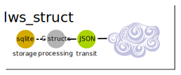

# lws_struct

## Overview

lws_struct provides a lightweight method for serializing and deserializing C
structs to and from JSON, and to and from sqlite3.

 - you provide a metadata array describing struct members one-time, then call
   generic apis to serialize and deserialize 

 - supports flat structs, single child struct pointers, and unbounded arrays /
   linked-lists of child objects automatically using [lws_dll2 linked-lists](./README.lws_dll.md)
 
 - supports boolean and C types char, int, long, long long in explicitly signed
   and unsigned forms
 
 - supports both char * type string members where the unbounded content is
   separate and pointed to, and fixed length char array[] type members where
   the content is part of the struct

 - huge linear strings are supported by storing to a temp lwsac of chained chunks,
   which is written into a single linear chunk in the main lwsac once the
   total string length is known
   
 - deserialization allocates into an [lwsac](../lib/misc/lwsac/README.md), so everything is inside as few
   heap allocations as possible while still able to expand to handle arbitrary
   array or strins sizes
   
 - when deserialized structs are finished with, a single call to free the
   lwsac frees the whole thing without having to walk it
   
 - stateful serializaton and deserialization allows as-you-get packets incremental
   parsing and production of chunks of as-you-can-send incremental serialization
   output cleanly

## Examples
