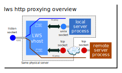

## Unix Domain Sockets Reverse Proxy

### Introduction

lws is able to use a mount to place reverse proxies into the URL space.

These are particularly useful when using Unix Domain Sockets, basically
files in the server filesystem, to communicate between lws and a separate
server process and integrate the result into a coherent URL namespace on
the lws side.  It's also possible to proxy using tcp sockets.

This has the advantage that the actual web server that forwards the
data from the unix socket owner is in a different process than the server
that serves on the unix socket.  If it has problems, they do not affect
the actual public-facing web server.  The unix domain socket server may
be in a completely different language than the web server.

Compared to CGI, there are no forks to make a connection to the unix
domain socket server.

### Mount origin format

Unix Domain Sockets are effectively "files" in the server filesystem, and
are defined by their filepath.  The "server" side that is to be proxied opens
the socket and listens on it, which creates a file in the server filesystem.
The socket understands either http or https protocol.

Lws can be told to act as a proxy for that at a mountpoint in the lws vhost
url space.

If your mount is expressed in C code, then the mount type is LWSMPRO_HTTP or
LWSMPRO_HTTPS depending on the protocol the unix socket understands, and the
origin address has the form `+/path/to/unix/socket:/path/inside/mount`.

The + at the start indicates it is a local unix socket we are proxying, and
the ':' acts as a delimiter for the socket path, since unlike other addresses
the unix socket path can contain '/' itself.

### Connectivity rules and translations

Onward proxy connections from lws to the Unix Domain Socket happen using
http/1.1.  That implies `transfer-encoding: chunking` in the case that the
length of the output is not known beforehand.

Lws takes care of stripping any chunking (which is illegal in h2) and
translating between h1 and h2 header formats if the return connection is
actually in http/2.

The h1 onward proxy connection translates the following headers from the return
connection, which may be h1 or h2:

Header|Function
---|---
host|Which vhost
etag|Information on any etag the client has cached for this URI
if-modified-since|Information on the freshness of any etag the client has cached for this URI
accept-language|Which languages the return path client prefers
accept-encoding|Which compression encodings the client can accept
cache-control|Information from the return path client about cache acceptability
x-forwarded-for|The IP address of the return path client

This implies that the proxied connection can

 - return 301 etc to say the return path client's etag is still valid

 - choose to compress using an acceptable content-encoding

The following headers are translated from the headers replied via the onward
connection (always h1) back to the return path (which may be h1 or h2)

Header|Function
---|---
content-length|If present, an assertion of how much payload is expected
content-type|The mimetype of the payload
etag|The canonical etag for the content at this URI
accept-language|This is returned to the return path client because there is no easy way for the return path client to know what it sent originally.  It allows clientside selection of i18n.
content-encoding|Any compression format on the payload (selected from what the client sent in accept-encoding, if anything)
cache-control|The onward server's response about cacheability of its payload

### h1 -> h2 conversion

Chunked encoding that may have been used on the outgoing proxy client connection
is removed for h2 return connections (chunked encoding is illegal for h2).

Headers are converted to all lower-case and hpack format for h2 return connections.

Header and payload proxying is staged according to when the return connection
(which may be an h2 child stream) is writable.

### Behaviour if unix domain socket server unavailable

If the server that listens on the unix domain socket is down or being restarted,
lws understands that it couldn't connect to it and returns a clean 503 response
`HTTP_STATUS_SERVICE_UNAVAILABLE` along with a brief human-readable explanation.

The generated status page produced will try to bring in a stylesheet
`/error.css`.  This allows you to produce a styled error pages with logos,
graphics etc.  See [this](https://libwebsockets.org/git/badrepo) for an example of what you can do with it.

