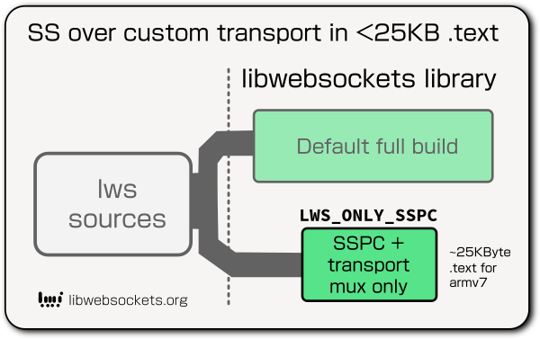
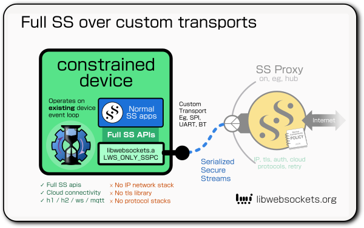

# SSPC client support

## Full vs LWS_ONLY_SSPC lws builds

SSPC (Secure Stream Proxy Client) apis are built into libwebsockets as you would
expect if built with `LWS_WITH_SECURE_STREAMS_PROXY_API`.  These are the client
SS api implementation, the serialization and deserialization of SS protocol, and
generic transport interface.

You can also choose to build lws so it ONLY contains the SSPC pieces suitable
for the client side, with the libwebsockets build option `LWS_ONLY_SSPC`.

Identical sources are used in both cases, but with `LWS_ONLY_SSPC` only the
parts related to mux and SSPC are included, coming to less than 25KB .text on
armv7 while providing the full proxied SS API.  Also excluded are the normal
`lws_context` and event loop facilities, the provided apis expect to work with
an existing event loop.

`LWS_ONLY_SSPC` facilitates using full libwebsockets SSPC client support on very
small devices that don't need the rest of lws.  Such devices do not need to have
tls, an IP stack or any network, yet can use full Secure Streams capabilities
via the proxy (eg, h2, including stream binding, or ws over tls).

`LWS_ONLY_SSPC` does not need a normal `struct lws_context` nor the lws event
loop or other apis.  To maintain compatibility with the SS apis the user code
provides a simple, static stub lws_context with a couple of members and no
creation or destruction.

You can find a minimal example that builds with `LWS_ONLY_SSPC` in
at `minimal-examples/secure-streams/minimal-secure-streams-custom-client-transport`,
implementing full SS apis over a UART link, where the client does not link to
lws nor need any network stack, tls library or internet protocol implementation.

It expects to use two USB serial adapters in loopback, one for this example and
one for the related proxy, minimal-secure-streams-custom-proxy-transport.

These two examples need different build dirs (but use the same libwebsockets
source) since the client requires lws built with `LWS_ONLY_SSPC`.

## Communication layers

Different transports have quite different semantics for connectivity. Serialized
SS communication has three abstract layers:

 - link: connectivity is established.  The serial cable is plugged in, the
   RF link is established, or the Posix Socket has connected.

 - mux: On some transports, eg, UART, there is a single logical link that we
   want to be able to carry multiple SS connections, so the transport must
   provide a way to negotiate multiplexing over the link.

 - Serialized SS: the SS activity serialized into a stream in both directions

How these look depend on the nature of the underlying transport, some examples:

|layer|RF|UART|Unix Domain Socket|
|---|---|---|---|
|link|managed at RF stack|detect by periodic PING/PONG|Socket Connection semantics|
|mux|extra framing|extra framing|not needed, one UDS client socket for each SS|
|Serialized SS|bytestream|bytestream|Datagram stream|

SSPC can directly hook up to an lws_transport_ops structure, this is used in the
case where multiplexing is handled by the transport like Unix Domain Socket link
to the proxy.  In that case, each SS makes its own personal Unix Domain Socket
link to the proxy.

The lws_transport_mux support is designed to interpose between SSPC layter and
the lws_transport itself, to provide its own multiplexing layer.  This is needed
in the case where there is just a reliable bytestream link to the proxy, and no
suitable channelization or link detection, for example a simple UART transport.

lws_transport_mux provides 250 mux channels over the transport, with link
detection by three-way PING handshakes at the mux layer. 

## LWS_ONLY_SSPC imports

Four system integration imports are needed by the library.

|prototype|function|
|---|---|
|lws_usec_t **lws_now_usecs**(void)|get us-resolution monotonic time|
|void **__lws_logv**(lws_log_cx_t *ignore1, lws_log_prepend_cx_t ignore2, void *ignore3, int filter, const char *_fun, const char *format, va_list ap)|log emit|
|void **lws_sul_schedule**(struct lws_context_standalone *ctx, int tsi, lws_sorted_usec_list_t *sul, sul_cb_t _cb, lws_usec_t _us)|schedule sul callback|
|void **lws_sul_cancel**(lws_sorted_usec_list_t *sul)|Cancel scheduled callback|

