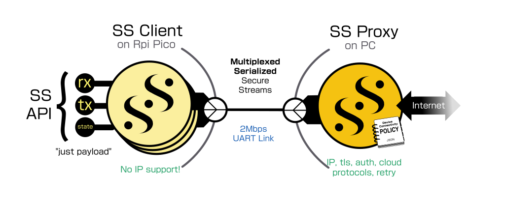
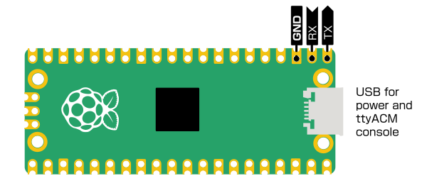

# Pico binance via SSPC / serial transport Example

This is a project for an RPi pico, a cheap, widely available US$4 networkless
133MHz Cortex M0 embedded SBC.

It is designed to run Serialized Secure Streams in a transport mux over
a UART running at 2Mbps, and demo two streams concurrently.



## Traffic on the UART link

The UART link has a lws_transport_mux layer that detects link up and down, and
above that Serialized SS travels in each mux channel.

1) Mux framing PING / PONG / PONGACK / link detect, channel open / close etc

2) SS to Binance compressed wss server

The pico runs the generic lws SS binance client and from around 30 messages a
second, reports the average price of bitcoin in realtime once a second,
same as it does if you run it on a PC and using the same SS code.

3) Every 5s another SS does a GET from https://warmcat.com/index.html to
demonstrate multiple SS muxing over the UART.

That involves compressed wss and h2, but the pico has:

 - no network stack (TCP/IP)
 - no tls
 - no h2
 - no wss protocol library
 - no wss compression extension
 
The pico creates a generic SS using the same code as the other examples, the
compressed wss connection is actually fulfilled by the proxy part (lws-minimal-
secure-streams-custom-proxy-transport) connected over the UART.  It passes
the bursty 20 - 120 KBytes/sec SS payloads over the UART where the binance
SS client consumes them as if it was all happening on the pico.

## Hookup



The three pins shown above need connecting to an FTDI-based
3.3V UART - USB adapter.

FTDI is needed because we will run the link at 2Mbps, most cheaper adapters
don't support this baud rate.

For this demo 2Mbps is required, since the websocket data from binance is very
bursty, we have to be able to clear a burst before the next one in order to
keep up.

## Build

This builds as a toplevel project using the pcio sdk, it builds
lws via a symlink, and links with libwebsockets.a built with `-DLWS_ONLY_SSPC`

Adapt `PICO_SDK_PATH` below to where your pico sdk is installed

```
$ cmake .. -DPICO_SDK_PATH=/projects/pico-sdk
$ make
```

You flash the pico by holding down the button and inserting USB, it mounts as a
USB storage device.  Copy `pico-sspc-binance.uf2` to the storage device and
unmount it.

## Running

On the PC, you need to build `lws-minimal-ssproxy-custom-transport-uart`, from
`./minimal-examples/ssproxy/ssproxy-custom-transport-uart`,
which needs lws built with `-DLWS_WITHOUT_EXTENSIONS=0`.  This connects to
`/dev/ttyUSB0` and starts the mux + SS Proxy.

On the Pico, you can monitor the serial console over USB to see logs via
`/dev/ttyACM0`, it's a bit awkward since that is created during Pico boot, so
you miss the earliest logs, but the app on the Pico won't do anything
interesting until it connects via the proxy, and shows periodic pings on the
mux layer until then.

Wait for peer (1Hz pings at mux layer)

```
11010626: lws_transport_mux_retry_connect
11010856: lws_transport_path_client_dump: lws_transport_mux_retry_connect: MUX: 2000AC80, IN: ops=txp_inside_sspc, priv=2000AD80, ONW: ops=txpmuxc, priv=00000000
11011109: lws_transport_mux_retry_connect: transport not operational
12004542: sul_ping_cb: issuing ping
12004802: lws_transport_path_client_dump: cpath: MUX: 00000000, IN: ops=txpmuxc, priv=2000AC80 (IsTM), ONW: ops=txpserial, priv=00000000
12005055: txp_serial_write: writing 9
12005287: 0000: F6 00 00 00 00 00 B7 2D 54                         .......-T       
12005441: 
12011287: lws_sspc_sul_retry_cb
12011438: lws_transport_mux_retry_connect
12011692: lws_transport_path_client_dump: lws_transport_mux_retry_connect: MUX: 2000AC80, IN: ops=txp_inside_sspc, priv=2000AD80, ONW: ops=txpmuxc, priv=00000000
12011935: lws_transport_mux_retry_connect: transport not operational
13012121: lws_sspc_sul_retry_cb
13012256: lws_transport_mux_retry_connect
13012492: lws_transport_path_client_dump: lws_transport_mux_retry_connect: MUX: 2000AC80, IN: ops=txp_inside_sspc, priv=2000AD80, ONW: ops=txpmuxc, priv=00000000
13012796: lws_transport_mux_retry_connect: transport not operational
```

Get mux layer `PING` from proxy / mux side, return PONG

```
13941468: lws_transport_mux_rx_parse: got PING
13941779: lws_transport_path_client_dump: cpath: MUX: 00000000, IN: ops=txpmuxc, priv=2000AC80 (IsTM), ONW: ops=txpserial, priv=00000000
13942054: txp_serial_write: writing 17
13942323: 0000: F7 00 00 00 00 00 00 00 00 00 00 00 00 00 D4 BB    ................
13942578: 0010: 98                                                 .               
13942738: 
```

Get mux later `PONGACK` (three way PING) response, both sides are up at mux layer.
This also provides the peer with the proxy device's time in us resolution.

```
13955788: lws_transport_mux_rx_parse: got PONGACK: ustime 1630898701380539
13956011: lws_transport_set_link: ******* transport mux link is UP
```

Retry the SS link to proxy at SSS layer, first request open mux channel

```
14012976: lws_sspc_sul_retry_cb
14013133: lws_transport_mux_retry_connect
14013356: lws_transport_path_client_dump: lws_transport_mux_retry_connect: MUX: 2000AC80, IN: ops=txp_inside_sspc, priv=2000AD80, ONW: ops=txpmuxc, priv=00000000
14013723: lws_transport_mux_retry_connect: added channel
14014026: lws_transport_path_client_dump: cpath: MUX: 00000000, IN: ops=txpmuxc, priv=2000AC80 (IsTM), ONW: ops=txpserial, priv=00000000
14014286: txp_serial_write: writing 2
14014471: 0000: F0 FF                                              ..              
14014702: 
```

Receive mux channel open ACK, mux channel ready on both sides, start to issue
Serialized Secure Streams in it: request binance SS stream

```
14019481: lws_transport_mux_rx_parse: ch 255 fully open
14019661: 0
14019880: lws_sspc_txp_tx: LPCSCLI_SENDING_INITIAL_TX
14020118: lws_transport_mux_write: 19
14020280: txp_serial_write: writing 23
14020553: 0000: F5 FF 00 13 AA 00 10 01 FF FF FF FF 1D CD 65 00    ..............e.
14020838: 0010: 62 69 6E 61 6E 63 65                               binance         
14020995: 
14037838: (unset) -> LWSSSCS_CREATING
```

SS states move forward as proxy fulfils the onward connection, then starts to
receive SSS payloads (previously compressed wss message payloads) and report
summaries at 1Hz

```
15090846: LWSSSCS_CREATING -> LWSSSCS_CONNECTING
15091150: LWSSSCS_CONNECTING -> LWSSSCS_CONNECTED
16091462: sul_hz_cb: price: min: 5170001¢, max: 5170867¢, avg: 5170245¢, (26 prices/s)
16091795: sul_hz_cb: elatency: min: 137ms, max: 296ms, avg: 203ms, (26 msg/s, 49 KiBytes/s SS RX)
17091455: sul_hz_cb: price: min: 5169104¢, max: 5170101¢, avg: 5169602¢, (33 prices/s)
17091746: sul_hz_cb: elatency: min: 139ms, max: 304ms, avg: 173ms, (33 msg/s, 94 KiBytes/s SS RX)
18091450: sul_hz_cb: price: min: 5169104¢, max: 5171400¢, avg: 5169304¢, (30 prices/s)
18091749: sul_hz_cb: elatency: min: 134ms, max: 167ms, avg: 139ms, (30 msg/s, 31 KiBytes/s SS RX)
19091460: sul_hz_cb: price: min: 5169183¢, max: 5169370¢, avg: 5169204¢, (29 prices/s)
19091753: sul_hz_cb: elatency: min: 136ms, max: 152ms, avg: 139ms, (29 msg/s, 31 KiBytes/s SS RX)
20091468: sul_hz_cb: price: min: 5169183¢, max: 5171063¢, avg: 5169664¢, (29 prices/s)
20091791: sul_hz_cb: elatency: min: 136ms, max: 151ms, avg: 139ms, (29 msg/s, 30 KiBytes/s SS RX)
21091482: sul_hz_cb: price: min: 5169183¢, max: 5171574¢, avg: 5169377¢, (30 prices/s)
21091759: sul_hz_cb: elatency: min: 136ms, max: 151ms, avg: 139ms, (30 msg/s, 44 KiBytes/s SS RX)
22091477: sul_hz_cb: price: min: 5168614¢, max: 5170771¢, avg: 5169225¢, (30 prices/s)
22091772: sul_hz_cb: elatency: min: 135ms, max: 148ms, avg: 139ms, (30 msg/s, 54 KiBytes/s SS RX)
23091491: sul_hz_cb: price: min: 5169058¢, max: 5169276¢, avg: 5169122¢, (28 prices/s)
23091772: sul_hz_cb: elatency: min: 136ms, max: 144ms, avg: 138ms, (28 msg/s, 22 KiBytes/s SS RX)
...
```

The periodic second SS reads from https://warmcat.com look like this (it dumps the first and
last 16 bytes of the rx packet)

```
42214221: lws_sspc_deserialize_parse: [mintest-lws|1]: : CONNECTED mintest-lws
42214520: lws_ss_serialize_state_transition: [mintest-lws|1]: : LPCSCLI_LOCAL_CONNECTED -> LPCSCLI_OPERATIONAL
42214849: lws_ss_check_next_state_sspc: [mintest-lws|1]: : LWSSSCS_CONNECTING -> LWSSSCS_CONNECTED
42215248: get_state: [mintest-lws|1]: : LWSSSCS_CONNECTED (5), ord 0x0
42220399: get_rx: [mintest-lws|1]: : RX 1520, flags 0x1
42220862: : 0000: 3C 21 44 4F 43 54 59 50 45 20 68 74 6D 6C 3E 0A    <!DOCTYPE html>.
42221074: : 
42221370: : 0000: 3C 6C 69 3E 38 30 20 6D 69 6E 69 6D 61 6C 20 65    <li>80 minimal e
42221580: : 
42305323: get_rx: [mintest-lws|1]: : RX 1520, flags 0x0
42305900: : 0000: 78 61 6D 70 6C 65 73 3A 20 3C 61 20 68 72 65 66    xamples: <a href
42306152: : 
42306411: : 0000: AD 98 3C 2F 74 64 3E 3C 74 64 20 63 6C 61 73 73    ..</td><td class
42306717: : 
42343404: get_rx: [mintest-lws|1]: : RX 1520, flags 0x0
42343967: : 0000: 3D 22 67 22 3E E2 AD 98 3C 2F 74 64 3E 3C 2F 74    ="g">...</td></t
42344184: : 
42344412: : 0000: 77 65 62 73 6F 63 6B 65 74 73 2F 74 72 65 65 2F    websockets/tree/
42344618: : 
42486791: get_rx: [mintest-lws|1]: : RX 1520, flags 0x0
42487366: : 0000: 6C 69 62 2F 65 76 65 6E 74 2D 6C 69 62 73 22 20    lib/event-libs" 
42487635: : 
42487894: : 0000: 31 36 20 69 62 22 3E 0A 20 20 20 20 20 3C 68 31    16 ib">.     <h1
42488113: : 
42527399: get_rx: [mintest-lws|1]: : RX 1277, flags 0x0
42527903: : 0000: 3E 51 41 3C 2F 68 31 3E 0A 20 20 20 20 20 20 4C    >QA</h1>.      L
42528116: : 
42528404: : 0000: 3C 2F 62 6F 64 79 3E 0A 3C 2F 68 74 6D 6C 3E 0A    </body>.</html>.
42528637: : 
42570288: get_rx: [mintest-lws|1]: : RX 0, flags 0x2
```
